# Hướng Dẫn Sử Dụng Web DocVault

DocVault là hệ thống quản lý tài liệu bảo mật (Secure Document Management System). Tài liệu này hướng dẫn các màn hình chính của ứng dụng web kèm ảnh chụp thực tế.

> Ảnh chụp được tạo bằng Playwright trên môi trường dev (`http://localhost:3006`), đăng nhập SSO qua Keycloak bằng tài khoản demo `editor1`.

---

## 1. Đăng nhập (Login)

Trang đăng nhập sử dụng SSO qua Keycloak. Nhấn **Sign in with SSO** rồi nhập tài khoản Keycloak.

Tài khoản demo (mật khẩu `Passw0rd!`):

| Tài khoản | Vai trò |
| --- | --- |
| `viewer1` | viewer |
| `editor1` | editor |
| `approver1` | approver |
| `co1` | compliance |

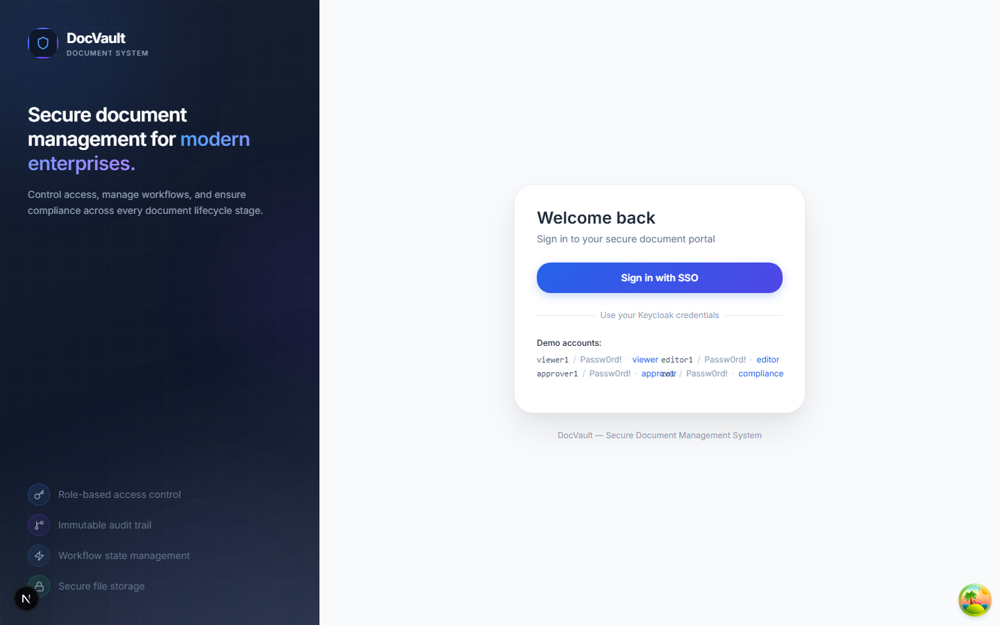

---

## 2. Dashboard

Tổng quan: số liệu tài liệu, biểu đồ, hoạt động gần đây và lối tắt tới các chức năng chính.

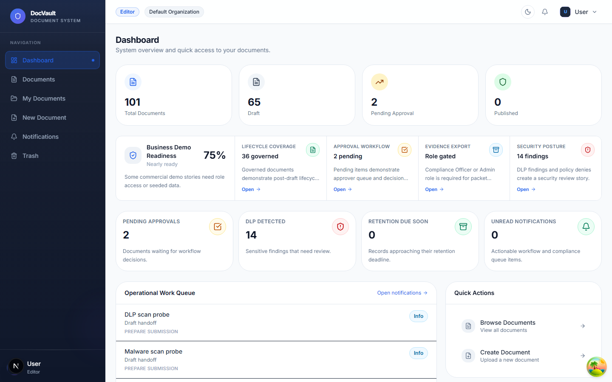

---

## 3. Documents (Tài liệu)

Danh sách tất cả tài liệu trong tổ chức kèm phân loại (classification), trạng thái DLP và các thao tác quản lý.

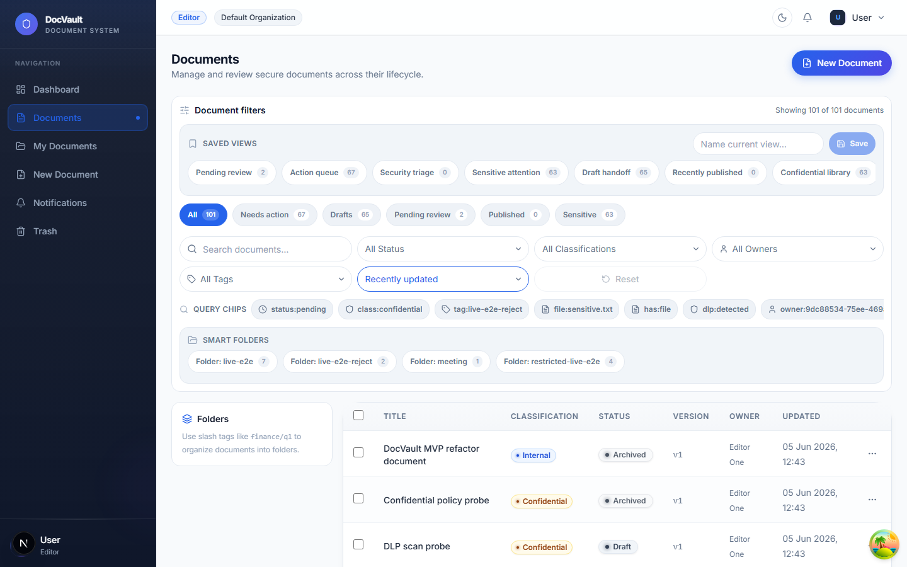

---

## 4. My Documents (Tài liệu của tôi)

Các tài liệu do người dùng hiện tại sở hữu.

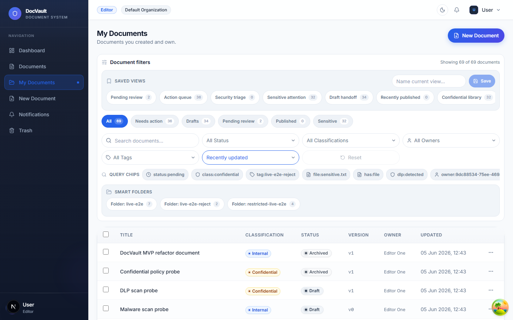

---

## 5. New Document (Tạo tài liệu mới)

Biểu mẫu tải lên và khai báo metadata cho tài liệu mới.

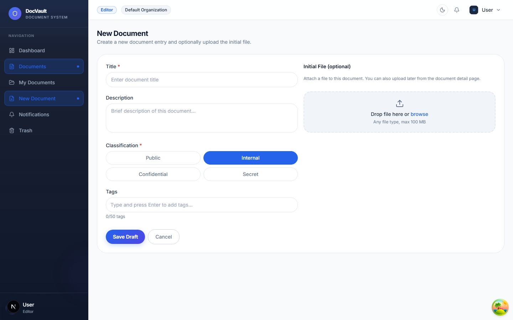

---

## 6. Shared (Chia sẻ)

Các tài liệu được chia sẻ và liên kết chia sẻ (share links).

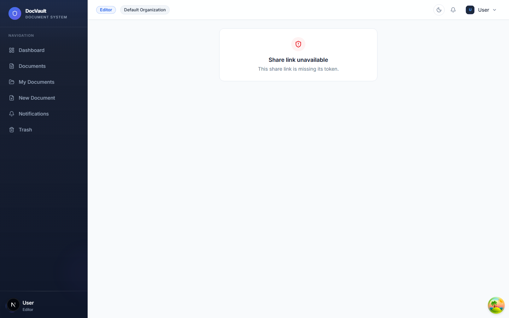

---

## 7. Approvals (Phê duyệt)

Hàng đợi phê duyệt tài liệu theo quy trình workflow dành cho approver.

---

## 8. Notifications (Thông báo)

Danh sách thông báo hệ thống và trạng thái đã đọc/chưa đọc.

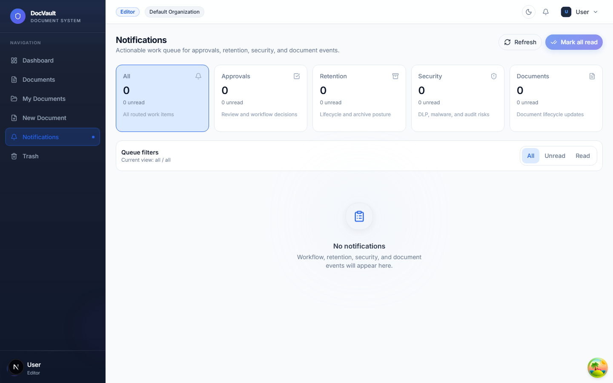

---

## 9. Audit (Nhật ký kiểm toán)

Nhật ký kiểm toán bất biến (audit trail) ghi lại các hành động trên tài liệu, phục vụ truy vết và tuân thủ.

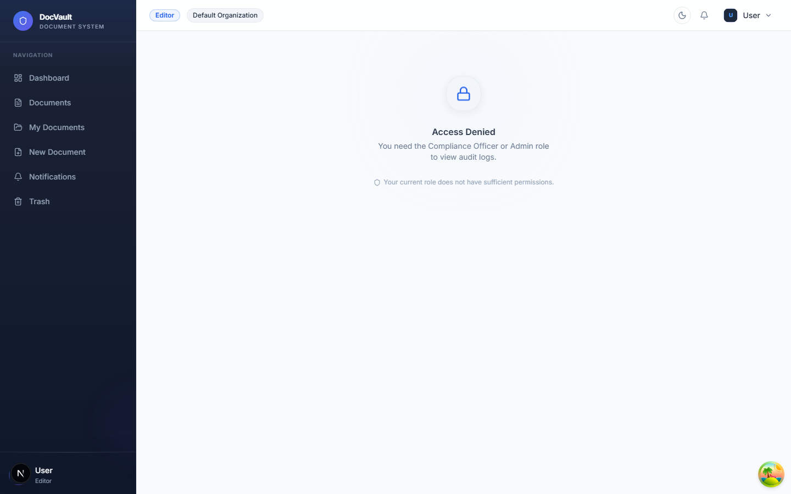

---

## 10. Trash (Thùng rác)

Các tài liệu đã xóa mềm, có thể khôi phục hoặc xóa vĩnh viễn.

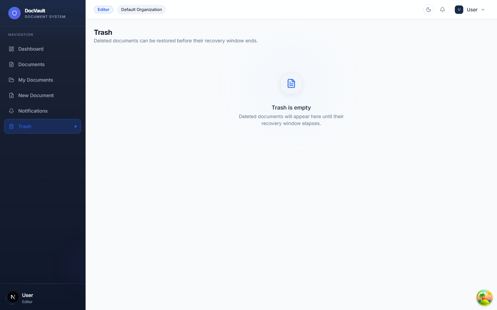

---

## 11. Profile (Hồ sơ)

Thông tin hồ sơ người dùng và vai trò.

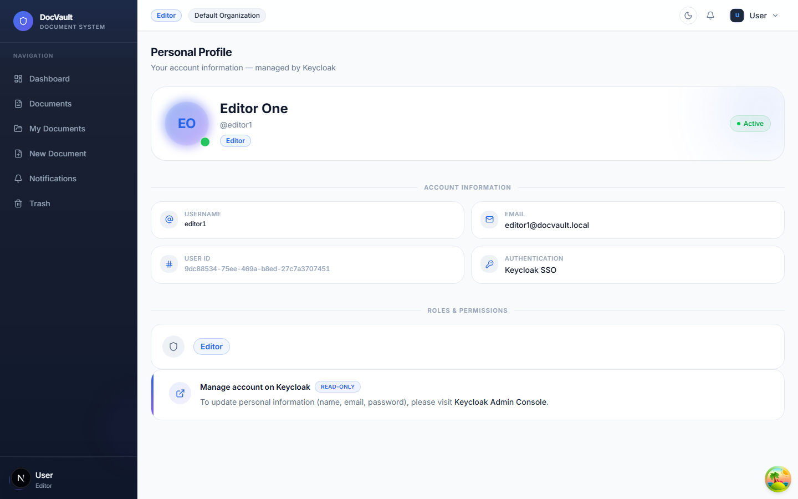

---

## 12. Settings (Cài đặt)

Cấu hình ứng dụng, bao gồm thông tin kết nối API gateway và các tùy chọn hệ thống.

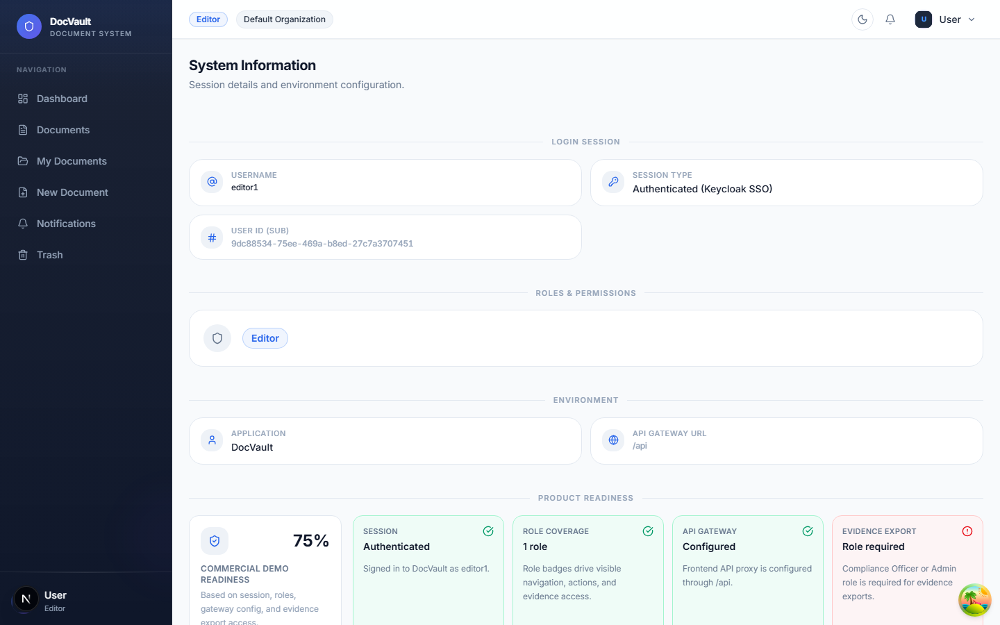

---

## Phụ lục: Chạy lại để chụp ảnh

1. Khởi động backend + Keycloak/DB (Docker), các service ở cổng `3000`–`3005`.
2. Chạy web dev: `pnpm --filter web dev` (mặc định cổng `3006`).
3. Đảm bảo `apps/web/.env.local` đặt `NEXT_PUBLIC_API_BASE_URL=/api` để frontend gọi qua proxy nội bộ (tránh bị CSP `connect-src ''self''` chặn).
4. Áp dụng migration metadata nếu có thay đổi schema: `pnpm --filter metadata-service exec prisma migrate deploy`.
5. Dùng Playwright đăng nhập SSO và chụp các trang (xem `scripts/capture-screenshots.mjs`).
