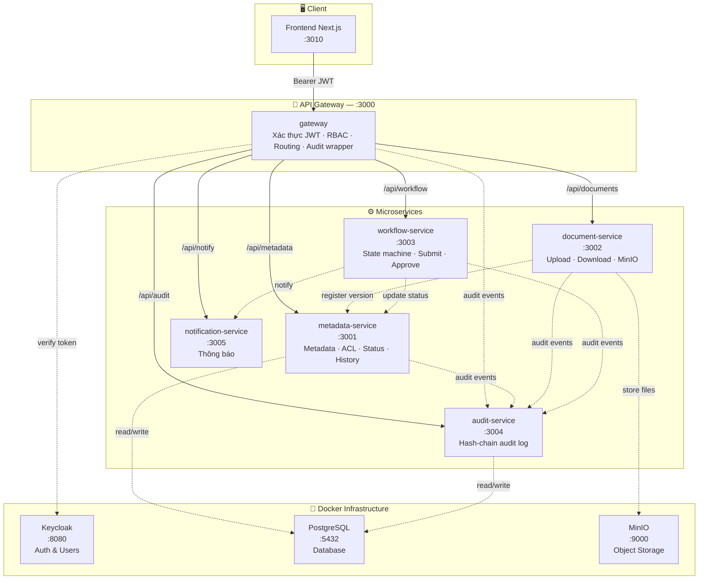
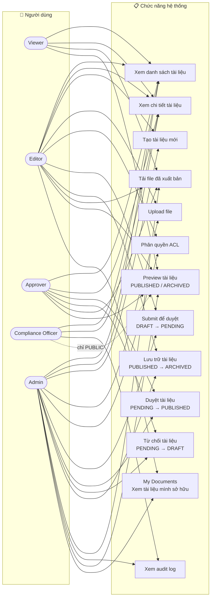

# DocVault

**DocVault** là hệ thống quản lý tài liệu doanh nghiệp theo kiến trúc **microservices**, xây dựng với NestJS. Hệ thống hỗ trợ vòng đời tài liệu đầy đủ: tạo → upload → duyệt → xuất bản → lưu trữ, kèm theo kiểm soát truy cập (RBAC) và nhật ký audit chống giả mạo.

---

## Kiến trúc hệ thống

### Sơ đồ tổng quan các tầng



### Vòng đời tài liệu


---

## Biểu đồ Use Case



> ⚠️ **Lưu ý:** Compliance Officer **không thể tải file** dù có bất kỳ quyền ACL nào — luật này được enforce ở tầng `metadata-service`. CO **có thể preview chỉ tài liệu PUBLIC** đã xuất bản/lưu trữ, nhưng vẫn thấy metadata (chi tiết) tất cả tài liệu PUBLISHED và ARCHIVED để phục vụ kiểm toán.

### Vai trò người dùng

| Vai trò | Quyền chính |
|---------|-------------|
| `viewer` | Xem danh sách (PUBLIC), preview, tải file đã xuất bản |
| `editor` | Tạo tài liệu, upload file, submit duyệt, lưu trữ (tài liệu của mình) |
| `approver` | Duyệt / từ chối tài liệu, preview **tất cả** classification |
| `compliance_officer` | Xem metadata tất cả tài liệu PUBLISHED + ARCHIVED, xem audit log, preview **chỉ PUBLIC** — **không được tải file** |
| `admin` | Toàn quyền |

### Ma trận Classification × Role

#### Xem danh sách (Document Visibility)

| Classification | viewer | editor | approver | CO | admin |
|---|:---:|:---:|:---:|:---:|:---:|
| `PUBLIC` | ✅ | ✅ | ✅ | ✅ | ✅ |
| `INTERNAL` | ❌ | ✅ | ✅ | ✅ | ✅ |
| `CONFIDENTIAL` | ❌ | ❌ | ✅ | ✅ | ✅ |
| `SECRET` | ❌ | ❌ | ✅ | ✅ | ✅ |

#### Preview tài liệu

| Classification | viewer | editor | approver | CO | admin |
|---|:---:|:---:|:---:|:---:|:---:|
| `PUBLIC` | ✅ | ✅ | ✅ | ✅ | ✅ |
| `INTERNAL` | ✅ | ✅ | ✅ | ❌ | ✅ |
| `CONFIDENTIAL` | ❌ | ✅¹ | ✅ | ❌ | ✅ |
| `SECRET` | ❌ | ❌ | ✅ | ❌ | ✅ |

> ¹ Cần explicit ACL hoặc là owner

> Ngoài ma trận trên, user luôn thấy tài liệu mình **sở hữu** hoặc có **ACL entry** cho mình — bất kể classification level.

---

## Yêu cầu cài đặt

| Công cụ | Phiên bản tối thiểu |
|---------|---------------------|
| Node.js | 18+ |
| pnpm | 8+ |
| Docker Desktop | 24+ |
| Git | bất kỳ |

---

## Hướng dẫn chạy dự án

### Cách nhanh — Một lệnh duy nhất

```bash
pnpm start:sequential
```

Script tự động khởi động **tất cả services theo đúng thứ tự**, polling health endpoint trước khi chuyển sang service tiếp theo:

```
metadata-service (:3001) → document-service (:3002) → workflow-service (:3003)
  → notification-service (:3005) → audit-service (:3004) → gateway (:3000)
```

Các bước tùy chọn (Prisma deploy, audit log migration) mặc định bị bỏ qua. Bật bằng:

```bash
RUN_PRISMA_DEPLOY=1 RUN_AUDIT_MIGRATION=1 pnpm start:sequential
```

Tùy chỉnh health-check timeout:

```bash
SERVICE_HEALTH_TIMEOUT_MS=180000 pnpm start:sequential
```

> Đảm bảo Docker infra đã chạy trước (xem Bước 1 bên dưới).

---

### Cách chi tiết — Từng bước

#### Bước 1 — Cài dependencies

```bash
pnpm install
```

#### Bước 2 — Khởi động hạ tầng (Docker)

Lệnh này sẽ khởi động: **PostgreSQL**, **MinIO**, **Keycloak** (kèm seed realm & user mẫu).

```bash
docker compose -f infra/docker-compose.dev.yml --env-file infra/.env.example up -d
```

Chờ tất cả container **healthy** (khoảng 30–60 giây):

```bash
docker compose -f infra/docker-compose.dev.yml ps
```

> **Services sau khi chạy:**
> - PostgreSQL: `localhost:5432`
> - MinIO Console: [http://localhost:9001](http://localhost:9001) (user: `minioadmin` / `minioadminpw`)
> - Keycloak Admin: [http://localhost:8080](http://localhost:8080) (user: `admin` / `adminpw`)

#### Bước 3 — Chạy database migration

```bash
# metadata-service (PostgreSQL)
pnpm --filter metadata-service prisma:deploy

# audit-service (PostgreSQL)
pnpm --filter audit-service prisma:deploy
```

#### Bước 4 — Khởi động các Backend Service

Mỗi service chạy trong một terminal riêng:

```bash
# Terminal 1 — metadata-service (port 3001)
pnpm --filter metadata-service start:dev

# Terminal 2 — document-service (port 3002)
pnpm --filter document-service start:dev

# Terminal 3 — workflow-service (port 3003)
pnpm --filter workflow-service start:dev

# Terminal 4 — audit-service (port 3004)
pnpm --filter audit-service start:dev

# Terminal 5 — notification-service (port 3005)
pnpm --filter notification-service start:dev

# Terminal 6 — gateway (port 3000) — khởi động SAU CÙNG
pnpm --filter gateway start:dev
```

> **Thứ tự quan trọng:** Gateway phải khởi động **sau** khi các services khác đã sẵn sàng.

#### Bước 5 — Khởi động Frontend

```bash
cd apps/web

# Sao chép file env
cp .env.example .env.local

# Chạy dev server
npx next dev -p 3010
```

Mở trình duyệt: [http://localhost:3010](http://localhost:3010)

---

## Kiểm tra hệ thống

### Chạy E2E kiểm tra toàn bộ luồng BE

```bash
node scripts/e2e-check.mjs
```

Bao gồm các kiểm tra:
- Không có token → 401
- Token hết hạn → 401
- Viewer tạo tài liệu → 403
- Editor tạo + upload → 201, file lưu vào MinIO ✅
- Viewer tải khi draft → 403
- Editor submit → PENDING
- Approver approve → PUBLISHED
- Approve lần 2 → 409 Conflict
- Viewer tải khi PUBLISHED → 200
- Compliance Officer tải file → 403
- Compliance Officer xem audit → 200
- Viewer xem audit → 403

### API Swagger

Sau khi services chạy:

| Service | Swagger UI |
|---------|-----------|
| Gateway | [http://localhost:3000/docs](http://localhost:3000/docs) |
| metadata-service | [http://localhost:3001/docs](http://localhost:3001/docs) |
| document-service | [http://localhost:3002/docs](http://localhost:3002/docs) |
| workflow-service | [http://localhost:3003/docs](http://localhost:3003/docs) |
| audit-service | [http://localhost:3004/docs](http://localhost:3004/docs) |
| notification-service | [http://localhost:3005/docs](http://localhost:3005/docs) |

---

## Tài khoản demo (Keycloak)

Mật khẩu tất cả tài khoản: **`Passw0rd!`**

| Username | Vai trò | Mô tả |
|----------|---------|-------|
| `viewer1` | viewer | Xem & tải tài liệu đã xuất bản |
| `editor1` | editor | Tạo, upload, submit tài liệu |
| `approver1` | approver | Duyệt / từ chối tài liệu |
| `co1` | compliance_officer | Xem audit log (không tải được file) |
| `admin1` | admin | Toàn quyền |

### Lấy JWT token từ Keycloak

```bash
curl -s -X POST \
  http://localhost:8080/realms/docvault/protocol/openid-connect/token \
  -H "Content-Type: application/x-www-form-urlencoded" \
  -d "client_id=docvault-gateway&client_secret=dev-gateway-secret&grant_type=password&username=editor1&password=Passw0rd!" \
  | jq -r '.access_token'
```

---

## Luồng nghiệp vụ chính

### Upload và Xuất bản tài liệu

```
Editor                    Gateway              Services
  │                          │                    │
  ├─ POST /api/metadata/documents ──────────────► │ Tạo metadata (DRAFT)
  ├─ POST /api/documents/:id/upload ───────────► │ Upload lên MinIO
  ├─ POST /api/workflow/:id/submit ────────────► │ DRAFT → PENDING
  │                                               │
Approver                                          │
  ├─ POST /api/workflow/:id/approve ───────────► │ PENDING → PUBLISHED
  │                                               │
Viewer                                            │
  └─ POST /api/documents/:id/presign-download ──► │ Lấy URL tải file
```

### Luồng Compliance

```
Compliance Officer   Gateway         metadata-service
  │                    │                    │
  ├─ GET /api/metadata/documents ─────────► │ Xem danh sách → 200 ✅
  ├─ GET /api/audit/query ─────────────────► │ Xem audit log → 200 ✅
  └─ POST /api/documents/:id/presign-download │ Tải file → 403 ❌ (luôn bị chặn)
```

---

## Cấu trúc thư mục

```
docvault/
├── apps/
│   └── web/                    # Frontend Next.js 15
├── services/
│   ├── gateway/                # API Gateway (NestJS, port 3000)
│   ├── metadata-service/       # Quản lý metadata & ACL (port 3001)
│   ├── document-service/       # Upload/Download MinIO (port 3002)
│   ├── workflow-service/       # State machine duyệt tài liệu (port 3003)
│   ├── audit-service/          # Audit log chống giả mạo (port 3004)
│   └── notification-service/   # Thông báo (port 3005)
├── infra/
│   ├── docker-compose.dev.yml  # Infra: Postgres, MinIO, Keycloak
│   ├── .env.example            # Cấu hình infra mẫu
│   └── keycloak/               # Realm config & seed users
├── scripts/
│   ├── e2e-check.mjs           # Script kiểm tra E2E tự động
│   ├── start-sequential.mjs    # Script khởi động tuần tự tất cả services
│   └── demo.sh                 # Demo script
└── docs/
    ├── demo-users.md           # Thông tin tài khoản & phân quyền
    ├── demo-flow.md            # Kịch bản demo từng bước
    ├── ERD.md                  # Entity Relationship Diagram chi tiết
    ├── PROJECT_STATUS.md       # Trạng thái project & known gaps
    └── verification-report.md  # Báo cáo kiểm tra tích hợp
```

---

## Mô hình dữ liệu

### Database `docvault_metadata` (PostgreSQL)

- `documents` — metadata, tags, phân loại, trạng thái, publishedAt, archivedAt
- `document_versions` — con trỏ tới các phiên bản file trên MinIO
- `document_acl` — kiểm soát quyền truy cập (USER / ROLE / GROUP)
- `document_workflow_history` — lịch sử chuyển trạng thái

### Database `docvault_audit` (PostgreSQL)

- `audit_events` — sự kiện audit với **hash chain SHA-256** chống giả mạo

### Database `docvault_metadata` — Document Comments

- `document_comments` — ghi chú/comment trên tài liệu (authorId, content, timestamp)

---

## Tính năng nâng cao

### Bulk Actions

Chọn nhiều tài liệu trong bảng và thực hiện hành động hàng loạt:

- **Bulk Submit**: Chọn nhiều DRAFT → Submit tất cả cùng lúc
- **Bulk Approve**: Approver chọn nhiều PENDING → Approve hàng loạt
- **Bulk Archive**: Chọn nhiều PUBLISHED → Archive cùng lúc

> Kết quả hiển thị qua toast: `"Bulk Submit: 3 succeeded, 1 failed"`.

### Document Comments

Tất cả user có quyền xem tài liệu đều có thể để lại comment/ghi chú:

- Hiển thị trên trang chi tiết tài liệu (cột phải)
- Hỗ trợ tất cả roles: viewer, editor, approver, CO, admin
- API: `GET/POST /api/metadata/documents/:docId/comments`

### Full-text Search (Server-side)

Tìm kiếm tài liệu qua tiêu đề, mô tả, và tags:

- Search được xử lý tại server (PostgreSQL ILIKE) → hiệu quả với dataset lớn
- API: `GET /api/metadata/documents?q=keyword`
- Frontend tự động gửi query tới server khi nhập vào ô tìm kiếm

### My Documents

Editor/Admin có trang riêng `/my-documents` hiển thị chỉ tài liệu mình sở hữu:

- Menu sidebar: **My Documents** (FolderOpen icon)
- Auto-filter theo `ownerId` — dễ quản lý tài liệu cá nhân
- Hỗ trợ đầy đủ: bulk actions, filters, submit/archive

---

## Ghi chú quan trọng

- **Compliance Officer** luôn bị từ chối tải file, kể cả khi ACL cho phép (logic trong `metadata-service/policy.service.ts`). CO **chỉ preview được tài liệu PUBLIC**, nhưng thấy metadata (chi tiết) tất cả tài liệu PUBLISHED và ARCHIVED để phục vụ kiểm toán.
- **Approver** là quyền cao nhất (non-admin) — có thể preview tài liệu ở **tất cả** classification levels.
- **Preview** hỗ trợ tài liệu `PUBLISHED` và `ARCHIVED`. PDF được render bằng `pdf.js` (canvas) — không có nút tải, không có right-click save.
- **Archive** chỉ dành cho editor sở hữu tài liệu hoặc admin (không phải approver). Tài liệu ARCHIVED **chỉ có thể preview**, không download.
- **Classification Visibility**: PUBLIC (tất cả) → INTERNAL (editor+) → CONFIDENTIAL (approver+) → SECRET (approver+). CO thấy tất cả PUBLISHED (metadata only).
- **Bulk Actions** hỗ trợ Submit, Approve, Archive hàng loạt — mỗi doc được gọi API tuần tự.
- **Document Comments** lưu trong table `document_comments` — không giới hạn số comment.
- Gateway tự động ghi audit cho mọi request nhận được.
- Trạng thái tài liệu: `DRAFT` → `PENDING` → `PUBLISHED` → `ARCHIVED`.
