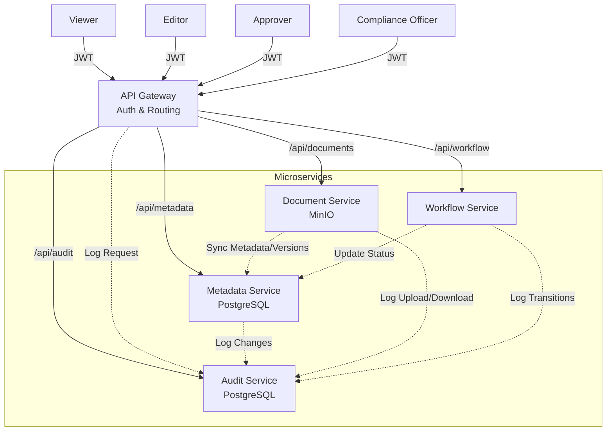
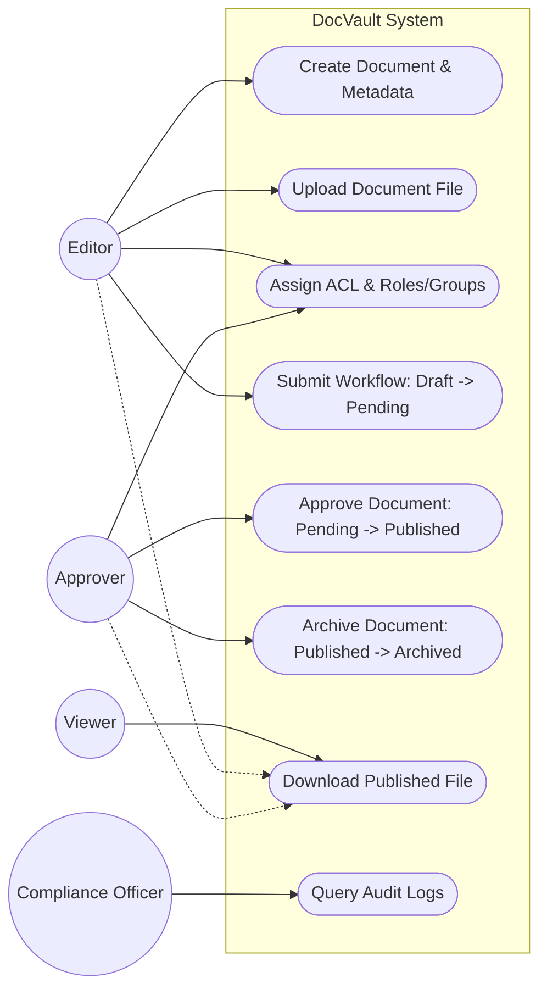

# DocVault

DocVault is a NestJS monorepo that now runs the MVP as actual microservices instead of a proto-microservice with all business logic inside `metadata-service`.

## Architecture



### Service boundaries

- `services/gateway`
  - Verifies Keycloak JWT by issuer/audience/expiration
  - Applies route-level RBAC
  - Routes `/api/metadata`, `/api/documents`, `/api/workflow`, `/api/audit`, `/api/notify`
  - Propagates `X-Request-Id`, `X-User-Id`, `X-Roles`
  - Emits gateway audit wrapper events: `REQUEST_RECEIVED`, `REQUEST_OK`, `REQUEST_DENIED`
- `services/metadata-service`
  - Source-of-truth for metadata, ACL, tags, status, current version pointer
  - Owns download authorization policy and records workflow history
  - Endpoints:
    - `POST /documents`
    - `GET /documents`
    - `GET /documents/:docId`
    - `PATCH /documents/:docId`
    - `POST /documents/:docId/acl`
    - `GET /documents/:docId/acl`
    - `POST /documents/:docId/versions`
    - `POST /documents/:docId/status`
    - `POST /documents/:docId/download-authorize`
    - `GET /documents/:docId/workflow-history`
- `services/document-service`
  - Owns MinIO upload/download/presign, checksum, object key generation
  - Object key format: `doc/{docId}/v{n}/{filename}`
  - Calls metadata-service to register uploaded version pointers
  - Endpoints:
    - `POST /documents/:docId/upload`
    - `POST /documents/:docId/presign-download`
    - `GET /documents/:docId/versions/:version/stream`
- `services/workflow-service`
  - Owns workflow state machine and transition validation (`DRAFT` → `PENDING` → `PUBLISHED` → `ARCHIVED`)
  - Calls metadata-service to update status
  - Calls audit-service and notification-service
  - Endpoints:
    - `POST /workflow/:docId/submit`
    - `POST /workflow/:docId/approve`
    - `POST /workflow/:docId/reject`
    - `POST /workflow/:docId/archive`
- `services/audit-service`
  - Append-only audit ingest and query with **Tamper-evident Hash Chain** security
  - `GET /audit/query` is `compliance_officer` only
  - Endpoints:
    - `POST /audit/events`
    - `GET /audit/query`
- `services/notification-service`
  - MVP notification sink
  - Logs `SUBMITTED`, `APPROVED`, `REJECTED`
  - Endpoint:
    - `POST /notify`

### Core rules

- Roles used by the services:
  - `viewer`
  - `editor`
  - `approver`
  - `compliance_officer`
  - `admin` is still accepted for local admin tasks
- `co` from the existing Keycloak realm is normalized to `compliance_officer` so the old seed keeps working.
- `compliance_officer` can query audit but is always denied file download.
- Download is enforced in backend by metadata-service policy plus document-service grant verification.

## Data model

### Metadata DB (`docvault_metadata`)

- `documents` (includes tags, classification, publishedAt, archivedAt)
- `document_versions`
- `document_acl` (supports USER, ROLE, GROUP)
- `document_workflow_history`

### Audit DB (`docvault_audit`)

- `audit_events`

Legacy tables from the early prototype can remain in `docvault_metadata`; the refactored services no longer use them.

## Local run

For the latest step-by-step local setup, see `docs/RUN_PROJECT.md`.

### 1. Install dependencies

```bash
pnpm install
```

### 2. Start infrastructure

```bash
docker compose -f infra/docker-compose.dev.yml --env-file infra/.env.example up -d
```

This brings up:

- Postgres
- MongoDB (unused by the MVP after this refactor, but left in compose)
- MinIO
- Keycloak

### 3. Copy env files

Create `.env` files from:

- `services/gateway/.env.example`
- `services/metadata-service/.env.example`
- `services/document-service/.env.example`
- `services/workflow-service/.env.example`
- `services/audit-service/.env.example`
- `services/notification-service/.env.example`

### 4. Apply database migrations

```bash
pnpm --filter metadata-service prisma:deploy
pnpm --filter audit-service prisma:deploy
```

### 5. Start services

Run each service in its own terminal:

```bash
pnpm --filter metadata-service start:dev
pnpm --filter document-service start:dev
pnpm --filter workflow-service start:dev
pnpm --filter audit-service start:dev
pnpm --filter notification-service start:dev
pnpm --filter gateway start:dev
```

Optional:

```bash
pnpm dev
```

Note: `pnpm dev` runs the whole workspace, including `apps/web`. The web app defaults to port `3000`, which conflicts with the gateway. The safer local setup is to run backend services separately and run the frontend on port `3100`.

### 6. Swagger

- Gateway: `http://localhost:3000/docs`
- Metadata: `http://localhost:3001/docs`
- Document: `http://localhost:3002/docs`
- Workflow: `http://localhost:3003/docs`
- Audit: `http://localhost:3004/docs`
- Notification: `http://localhost:3005/docs`

### 7. Frontend Web App

The frontend is a Next.js 16 app in `apps/web`.

**Run:**

```bash
pnpm --filter web dev -- --port 3100
```

> **Port note:** Use port `3100` for the frontend. Ports `3000` to `3005` are already used by gateway and backend services.

**Env config:**

Copy `apps/web/.env.example` to `apps/web/.env.local`:

```bash
cp apps/web/.env.example apps/web/.env.local
```

`.env.local` contents:

```env
NEXT_PUBLIC_APP_NAME=DocVault
NEXT_PUBLIC_API_BASE_URL=http://localhost:3000/api
```

**Login modes:**

- **Demo Login** (no backend): Select a role (viewer/editor/approver/compliance_officer/admin), enter any username → creates a mock session. UI and route guards work without real backend.
- **JWT Token Login**: Paste a real JWT from Keycloak. The FE will extract user info and authenticate against the real backend.

**Build for production:**

```bash
pnpm --filter web build
pnpm --filter web start -- --port 3100
```

## Sequence flows

### Upload and publish

1. `editor1` creates metadata through gateway `POST /api/metadata/documents`
2. `editor1` uploads blob through gateway `POST /api/documents/:docId/upload`
3. document-service uploads to MinIO and calls metadata-service `POST /documents/:docId/versions`
4. `editor1` submits workflow through gateway `POST /api/workflow/:docId/submit`
5. workflow-service validates `DRAFT -> PENDING` and updates metadata status
6. `approver1` approves through gateway `POST /api/workflow/:docId/approve`
7. workflow-service validates `PENDING -> PUBLISHED` and updates metadata status
8. `viewer1` downloads through gateway `POST /api/documents/:docId/presign-download` or `GET /api/documents/:docId/versions/:version/stream`

### Compliance flow

1. `co1` can read metadata and query audit through `GET /api/audit/query`
2. `co1` is denied by `POST /api/metadata/documents/:docId/download-authorize`
3. `co1` is denied by `POST /api/documents/:docId/presign-download`
4. `co1` is denied by `GET /api/documents/:docId/versions/:version/stream`

## Use Cases (Business Flows)



### 1. Document Creation & Upload (Editor)
- An **Editor** creates a new document entry with metadata, assigning classification (e.g., `CONFIDENTIAL`) and tags (e.g., `finance`, `report`). The document starts in the `DRAFT` state.
- The Editor uploads the physical file (PDF/Docx), which is streamed to MinIO. The Document Service registers the new version with the Metadata Service.

### 2. Group & Role based Access Control
- The document owner or an Admin can assign ACL permissions. Instead of just picking single users, they can assign permissions (`READ`, `WRITE`, `APPROVE`) to specific **GROUPs** (e.g., `finance-team`) or roles (`approver`).

### 3. Document Approval Workflow
- When the draft is ready, the Editor **Submits** the workflow. The state transitions from `DRAFT` to `PENDING`.
- An **Approver** reviews the document and triggers **Approve**. The state transitions from `PENDING` to `PUBLISHED`, and `publishedAt` is recorded.
- Every transition automatically generates an atomic record in the `document_workflow_history` table and an audit event.

### 4. Secure File Download (Viewer)
- A **Viewer** requests to download a document.
- The Gateway routes the request to Document Service, which synchronously calls Metadata Service to evaluate the ACL policy.
- If the document is `PUBLISHED` and the Viewer has `READ` permission (via user, role, or group), a short-lived MinIO presigned URL is returned.

### 5. Document Archival
- When a published document reaches the end of its lifecycle, an Admin or Approver triggers the **Archive** action.
- The document transitions to `ARCHIVED`, locking it from further active workflows while retaining history.

### 6. Compliance Audit Tracking (Compliance Officer)
- Every significant action (create, upload, download, workflow state change) generates an audit event.
- The Audit Service links events securely using a **Tamper-evident Hash Chain** (`SHA-256(prevHash + payload)`), making it impossible to silently alter history.
- A **Compliance Officer** can query these logs securely. However, the system enforces a strict rule: Compliance Officers can *never* download the actual document blobs, ensuring separation of duties.

## Demo and checks

### Demo script

```bash
./scripts/demo.sh
```

The wrapper calls:

```bash
node scripts/e2e-check.mjs
```

### E2E checks covered

- no token -> metadata 401
- expired-like token -> metadata 401
- viewer create document -> 403
- editor create document -> 201
- editor upload -> object exists in MinIO
- viewer download while document is `DRAFT` -> 403
- editor submit -> `PENDING`
- approver approve -> `PUBLISHED`
- second approve -> 409
- viewer published download -> 200
- compliance officer download -> 403
- compliance officer audit query -> 200
- viewer audit query -> 403

`EXPIRED_ACCESS_TOKEN` can be provided to the script if you want to use a real expired token instead of the default expired-like invalid JWT used for the 401 check.

## Seed users

Password for every seeded user: `Passw0rd!`

| Username | Role mapping |
| --- | --- |
| `viewer1` | `viewer` |
| `editor1` | `editor` |
| `approver1` | `approver` |
| `co1` | `co` + `compliance_officer` |
| `admin1` | `admin` |

## Migration notes

### Metadata service

- New runtime tables:
  - `documents`
  - `document_versions`
  - `document_acl`
- New migration: `services/metadata-service/prisma/migrations/20260315000000_refactor_microservices_boundary`
- Old prototype tables are not used by the refactored code paths.

### Audit service

- New database: `docvault_audit`
- New runtime table:
  - `audit_events`
- New migration: `services/audit-service/prisma/migrations/20260315001000_init_audit_service`
- `infra/db/init-postgres.sql` now creates `docvault_audit` and enables `uuid-ossp` in both databases.

If you already have an older Postgres volume from the proto-microservice setup, recreate it or create `docvault_audit` manually before running the new migrations.
