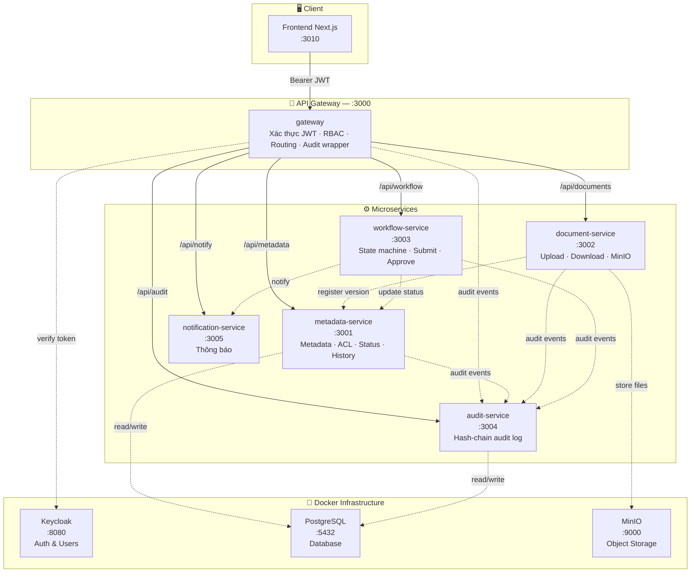
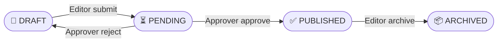
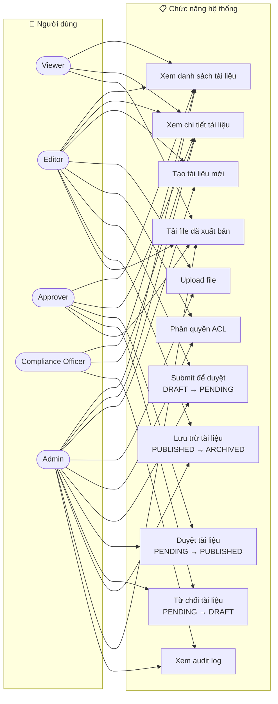

# DocVault

**DocVault** là hệ thống quản lý tài liệu doanh nghiệp theo kiến trúc **microservices**, xây dựng với NestJS. Hệ thống hỗ trợ vòng đời tài liệu đầy đủ: tạo → upload → duyệt → xuất bản → lưu trữ, kèm theo kiểm soát truy cập (RBAC) và nhật ký audit chống giả mạo.

---

## Kiến trúc hệ thống

### Sơ đồ tổng quan các tầng



### Vòng đời tài liệu



---

## Biểu đồ Use Case



> ⚠️ **Lưu ý:** Compliance Officer **không thể tải file** dù có bất kỳ quyền ACL nào — luật này được enforce ở tầng `metadata-service`.

### Vai trò người dùng

| Vai trò | Quyền chính |
|---------|-------------|
| `viewer` | Xem danh sách, xem chi tiết, tải file đã xuất bản |
| `editor` | Tạo tài liệu, upload file, submit duyệt, lưu trữ (tài liệu của mình) |
| `approver` | Duyệt / từ chối tài liệu đang chờ |
| `compliance_officer` | Xem audit log — **không được tải file** |
| `admin` | Toàn quyền |

---

## Yêu cầu cài đặt

| Công cụ | Phiên bản tối thiểu |
|---------|---------------------|
| Node.js | 18+ |
| pnpm | 8+ |
| Docker Desktop | 24+ |
| Git | bất kỳ |

---

## Hướng dẫn chạy dự án

### Bước 1 — Cài dependencies

```bash
pnpm install
```

### Bước 2 — Khởi động hạ tầng (Docker)

Lệnh này sẽ khởi động: **PostgreSQL**, **MinIO**, **Keycloak** (kèm seed realm & user mẫu).

```bash
docker compose -f infra/docker-compose.dev.yml --env-file infra/.env.example up -d
```

Chờ tất cả container **healthy** (khoảng 30–60 giây):

```bash
docker compose -f infra/docker-compose.dev.yml ps
```

> **Services sau khi chạy:**
> - PostgreSQL: `localhost:5432`
> - MinIO Console: [http://localhost:9001](http://localhost:9001) (user: `minioadmin` / `minioadminpw`)
> - Keycloak Admin: [http://localhost:8080](http://localhost:8080) (user: `admin` / `adminpw`)

### Bước 3 — Chạy database migration

```bash
# metadata-service (PostgreSQL)
pnpm --filter metadata-service prisma:deploy

# audit-service (PostgreSQL)
pnpm --filter audit-service prisma:deploy
```

### Bước 4 — Khởi động các Backend Service

Mỗi service chạy trong một terminal riêng:

```bash
# Terminal 1 — metadata-service (port 3001)
pnpm --filter metadata-service start:dev

# Terminal 2 — document-service (port 3002)
pnpm --filter document-service start:dev

# Terminal 3 — workflow-service (port 3003)
pnpm --filter workflow-service start:dev

# Terminal 4 — audit-service (port 4004)
pnpm --filter audit-service start:dev

# Terminal 5 — notification-service (port 3005)
pnpm --filter notification-service start:dev

# Terminal 6 — gateway (port 3000) — khởi động SAU CÙNG
pnpm --filter gateway start:dev
```

> **Thứ tự quan trọng:** Gateway phải khởi động **sau** khi các services khác đã sẵn sàng.

### Bước 5 — Khởi động Frontend

```bash
cd apps/web

# Sao chép file env
cp .env.example .env.local

# Chạy dev server
npx next dev -p 3010
```

Mở trình duyệt: [http://localhost:3010](http://localhost:3010)

---

## Kiểm tra hệ thống

### Chạy E2E kiểm tra toàn bộ luồng BE

```bash
node scripts/e2e-check.mjs
```

Bao gồm các kiểm tra:
- Không có token → 401
- Token hết hạn → 401
- Viewer tạo tài liệu → 403
- Editor tạo + upload → 201, file lưu vào MinIO ✅
- Viewer tải khi draft → 403
- Editor submit → PENDING
- Approver approve → PUBLISHED
- Approve lần 2 → 409 Conflict
- Viewer tải khi PUBLISHED → 200
- Compliance Officer tải file → 403
- Compliance Officer xem audit → 200
- Viewer xem audit → 403

### API Swagger

Sau khi services chạy:

| Service | Swagger UI |
|---------|-----------|
| Gateway | [http://localhost:3000/docs](http://localhost:3000/docs) |
| metadata-service | [http://localhost:3001/docs](http://localhost:3001/docs) |
| document-service | [http://localhost:3002/docs](http://localhost:3002/docs) |
| workflow-service | [http://localhost:3003/docs](http://localhost:3003/docs) |
| audit-service | [http://localhost:3004/docs](http://localhost:3004/docs) |
| notification-service | [http://localhost:3005/docs](http://localhost:3005/docs) |

---

## Tài khoản demo (Keycloak)

Mật khẩu tất cả tài khoản: **`Passw0rd!`**

| Username | Vai trò | Mô tả |
|----------|---------|-------|
| `viewer1` | viewer | Xem & tải tài liệu đã xuất bản |
| `editor1` | editor | Tạo, upload, submit tài liệu |
| `approver1` | approver | Duyệt / từ chối tài liệu |
| `co1` | compliance_officer | Xem audit log (không tải được file) |
| `admin1` | admin | Toàn quyền |

### Lấy JWT token từ Keycloak

```bash
curl -s -X POST \
  http://localhost:8080/realms/docvault/protocol/openid-connect/token \
  -H "Content-Type: application/x-www-form-urlencoded" \
  -d "client_id=docvault-gateway&client_secret=dev-gateway-secret&grant_type=password&username=editor1&password=Passw0rd!" \
  | jq -r '.access_token'
```

---

## Luồng nghiệp vụ chính

### Upload và Xuất bản tài liệu

```
Editor                    Gateway              Services
  │                          │                    │
  ├─ POST /api/metadata/documents ──────────────► │ Tạo metadata (DRAFT)
  ├─ POST /api/documents/:id/upload ───────────► │ Upload lên MinIO
  ├─ POST /api/workflow/:id/submit ────────────► │ DRAFT → PENDING
  │                                               │
Approver                                          │
  ├─ POST /api/workflow/:id/approve ───────────► │ PENDING → PUBLISHED
  │                                               │
Viewer                                            │
  └─ POST /api/documents/:id/presign-download ──► │ Lấy URL tải file
```

### Luồng Compliance

```
Compliance Officer   Gateway         metadata-service
  │                    │                    │
  ├─ GET /api/metadata/documents ─────────► │ Xem danh sách → 200 ✅
  ├─ GET /api/audit/query ─────────────────► │ Xem audit log → 200 ✅
  └─ POST /api/documents/:id/presign-download │ Tải file → 403 ❌ (luôn bị chặn)
```

---

## Cấu trúc thư mục

```
docvault/
├── apps/
│   └── web/                    # Frontend Next.js 15
├── services/
│   ├── gateway/                # API Gateway (NestJS, port 3000)
│   ├── metadata-service/       # Quản lý metadata & ACL (port 3001)
│   ├── document-service/       # Upload/Download MinIO (port 3002)
│   ├── workflow-service/       # State machine duyệt tài liệu (port 3003)
│   ├── audit-service/          # Audit log chống giả mạo (port 3004)
│   └── notification-service/   # Thông báo (port 3005)
├── infra/
│   ├── docker-compose.dev.yml  # Infra: Postgres, MinIO, Keycloak
│   ├── .env.example            # Cấu hình infra mẫu
│   └── keycloak/               # Realm config & seed users
├── scripts/
│   ├── e2e-check.mjs           # Script kiểm tra E2E tự động
│   └── demo.sh                 # Demo script
└── docs/
    ├── demo-users.md           # Thông tin tài khoản & phân quyền
    ├── demo-flow.md            # Kịch bản demo từng bước
    └── verification-report.md  # Báo cáo kiểm tra tích hợp
```

---

## Mô hình dữ liệu

### Database `docvault_metadata` (PostgreSQL)

- `documents` — metadata, tags, phân loại, trạng thái, publishedAt, archivedAt
- `document_versions` — con trỏ tới các phiên bản file trên MinIO
- `document_acl` — kiểm soát quyền truy cập (USER / ROLE / GROUP)
- `document_workflow_history` — lịch sử chuyển trạng thái

### Database `docvault_audit` (PostgreSQL)

- `audit_events` — sự kiện audit với **hash chain SHA-256** chống giả mạo

---

## Ghi chú quan trọng

- **Compliance Officer** luôn bị từ chối tải file, kể cả khi ACL cho phép (logic trong `metadata-service/policy.service.ts`).
- **Archive** chỉ dành cho editor sở hữu tài liệu hoặc admin (không phải approver).
- Gateway tự động ghi audit cho mọi request nhận được.
- Trạng thái tài liệu: `DRAFT` → `PENDING` → `PUBLISHED` → `ARCHIVED`.
