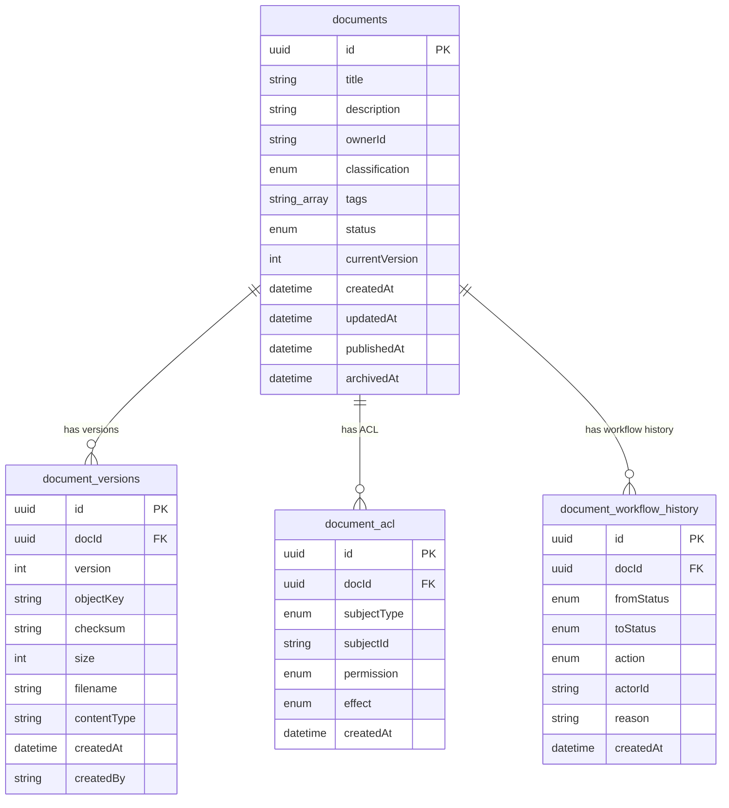
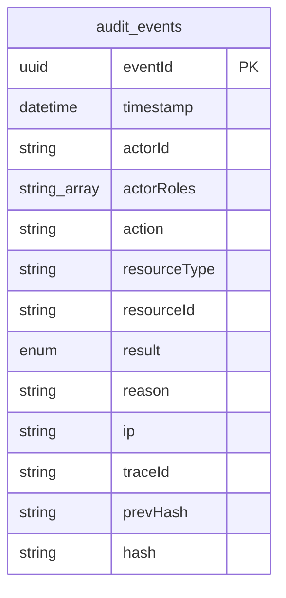
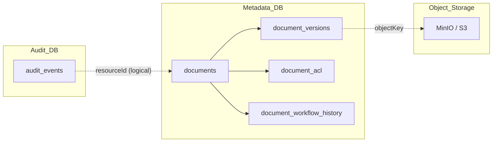

# DocVault ERD

Updated: 2026-03-15

This document describes the Entity-Relationship Diagram of DocVault, aligned with the current **MVP** implementation in the **microservices** architecture.

---

## 1. Design Principles

### 1.1. Data Architecture Overview

| Layer | Owned By | Contains |
|---|---|---|
| **Metadata DB** (`docvault_metadata`) | `metadata-service` | documents, document_versions, document_acl, document_workflow_history |
| **Audit DB** (`docvault_audit`) | `audit-service` | audit_events (append-only, tamper-evident) |
| **Object Storage** (MinIO / S3) | `document-service` | Actual blob files, referenced via `document_versions.objectKey` |

### 1.2. Design Principles

- **Separation of metadata and blob**: Postgres holds metadata + pointer, MinIO holds file content.
- **Clear service boundary**: Each service owns its own DB, no cross-query directly.
- **Loose coupling for audit**: `audit_events` does not use hard FKs to `documents` to keep the append-only boundary and allow audit-service to scale independently.
- **External identity**: `ownerId`, `actorId`, `subjectId` are references to Keycloak, no internal `users` table.
- **MVP-first**: Design is sufficient for actual implementation, avoid over-engineering.

### 1.3. Design Decision Rationale

| Decision | Reason |
|---|---|
| Workflow MVP has no separate `APPROVED` status | APPROVE is an **action** transitioning PENDING → PUBLISHED. Merging reduces state machine complexity. Multi-step approval can be added later if needed. |
| `tags` uses `text[]` (PostgreSQL array) | Simple for MVP, no join table `document_tags` needed. GIN index supports efficient query. |
| `audit_events` has no FK to `documents` | Audit-service is a bounded context, append-only. `resourceId` stores documentId/versionId as strings, allowing audit of non-document resources too. |
| Need `document_workflow_history` in addition to `audit_events` | Audit trail records all system events (upload, download, login...), while workflow history only records business status transitions. Workflow history belongs to metadata-service, serving fast audit trace without cross-service query. |
| `currentVersion` is `Int` | Sufficient for MVP. Future can upgrade to `currentVersionId` (UUID FK) for precise version record pointer. |

---

## 2. Main Entities

### 2.1. `documents`

**Service owner**: metadata-service

**Purpose**: Source-of-truth for document metadata. Each record represents a logical document in the system.

#### Columns

| Column | Type | Constraints | Description |
|---|---|---|---|
| `id` | `UUID` | PK, auto-generated | Primary key |
| `title` | `String` | NOT NULL | Document name |
| `description` | `String?` | nullable | Short description |
| `ownerId` | `String` | NOT NULL | Keycloak user ID of the owner |
| `classification` | `ClassificationLevel` | NOT NULL, default `INTERNAL` | Security classification level |
| `tags` | `String[]` | default `[]` | Classification tags, stored as PostgreSQL text array |
| `status` | `DocumentStatus` | NOT NULL, default `DRAFT` | Current status |
| `currentVersion` | `Int` | NOT NULL, default `0` | Current version pointer |
| `createdAt` | `DateTime` | NOT NULL, auto | Creation timestamp |
| `updatedAt` | `DateTime` | NOT NULL, auto | Last update timestamp |
| `publishedAt` | `DateTime?` | nullable | Publish timestamp (set when APPROVE) |
| `archivedAt` | `DateTime?` | nullable | Archive timestamp |

#### Enums

**`DocumentStatus`**:
- `DRAFT` — newly created or rejected back
- `PENDING` — submitted, awaiting approval
- `PUBLISHED` — approved and published
- `ARCHIVED` — archived, read-only

**`ClassificationLevel`**:
- `PUBLIC` — public
- `INTERNAL` — internal (default)
- `CONFIDENTIAL` — confidential
- `SECRET` — secret

#### Indexes

- `@@index([ownerId])` — query documents by owner
- `@@index([status])` — filter by status
- `@@index([tags], type: Gin)` — GIN index for full-array search on PostgreSQL

#### Notes

- `currentVersion` increments monotonically when a new version is uploaded.
- `publishedAt` is set once when the document transitions to PUBLISHED, **not reset** if the document is archived and then re-published (if that future flow exists).
- `classification` is currently an enum. If dynamic classification levels are needed, can migrate to a lookup table later.

---

### 2.2. `document_versions`

**Service owner**: metadata-service

**Purpose**: Stores version pointers for each uploaded file version. Each version points to a blob object in MinIO.

#### Columns

| Column | Type | Constraints | Description |
|---|---|---|---|
| `id` | `UUID` | PK, auto-generated | Primary key |
| `docId` | `UUID` | FK → `documents.id`, ON DELETE CASCADE | Parent document |
| `version` | `Int` | NOT NULL | Version number |
| `objectKey` | `String` | NOT NULL | MinIO key, format: `doc/{docId}/v{n}/{filename}` |
| `checksum` | `String` | NOT NULL | SHA-256 hash of the file |
| `size` | `Int` | NOT NULL | File size (bytes) |
| `filename` | `String` | NOT NULL | Original filename at upload |
| `contentType` | `String?` | nullable | MIME type |
| `createdAt` | `DateTime` | NOT NULL, auto | Version creation timestamp |
| `createdBy` | `String` | NOT NULL | Keycloak user ID of creator |

#### Constraints

- `@@unique([docId, version])` — each document has exactly one unique version number
- `@@index([docId, createdAt])` — query versions by document, sorted by time

#### Notes

- `objectKey` is a logical pointer to MinIO. Deleting the record does not automatically delete the blob (requires a background job or lifecycle policy).
- `createdBy` may differ from `documents.ownerId` if someone else uploads a new version.

---

### 2.3. `document_acl`

**Service owner**: metadata-service

**Purpose**: Stores per-document access control policies. Supports granting/denying permissions for user, role, group, or everyone.

#### Columns

| Column | Type | Constraints | Description |
|---|---|---|---|
| `id` | `UUID` | PK, auto-generated | Primary key |
| `docId` | `UUID` | FK → `documents.id`, ON DELETE CASCADE | Applied document |
| `subjectType` | `AclSubjectType` | NOT NULL | Subject type |
| `subjectId` | `String?` | nullable | ID of user/role/group. NULL when `subjectType = ALL` |
| `permission` | `DocumentPermission` | NOT NULL | Granted/denied permission |
| `effect` | `AclEffect` | NOT NULL | Allow or deny |
| `createdAt` | `DateTime` | NOT NULL, auto | Rule creation timestamp |

#### Enums

**`AclSubjectType`**:
- `USER` — a specific user (subjectId = Keycloak user ID)
- `ROLE` — a role (subjectId = role name)
- `GROUP` — a Keycloak group (subjectId = group ID)
- `ALL` — everyone (subjectId = NULL)

**`DocumentPermission`**:
- `READ` — view metadata + content
- `DOWNLOAD` — download file
- `WRITE` — edit metadata, upload new version
- `APPROVE` — approve document

**`AclEffect`**:
- `ALLOW` — permit
- `DENY` — deny (takes precedence over ALLOW when evaluating)

#### Indexes

- `@@index([docId, permission])` — lookup permissions by document
- `@@index([subjectType, subjectId])` — lookup rule by subject

#### Notes

- When evaluating ACL: DENY always wins over ALLOW (deny-overrides strategy).
- `subjectId` is a generic string for compatibility with multiple identity types from Keycloak.

---

### 2.4. `document_workflow_history`

**Service owner**: metadata-service (called by workflow-service)

**Purpose**: Stores business status transition history of a document. Enables tracing who submitted/approved/rejected, when, and for what reason.

> **This is a new table**, added for MVP to support workflow tracing without cross-service query to audit-service.

#### Columns

| Column | Type | Constraints | Description |
|---|---|---|---|
| `id` | `UUID` | PK, auto-generated | Primary key |
| `docId` | `UUID` | FK → `documents.id`, ON DELETE CASCADE | Related document |
| `fromStatus` | `DocumentStatus` | NOT NULL | Previous status |
| `toStatus` | `DocumentStatus` | NOT NULL | New status |
| `action` | `WorkflowAction` | NOT NULL | Action performed |
| `actorId` | `String` | NOT NULL | Keycloak user ID of the performer |
| `reason` | `String?` | nullable | Reason (required for REJECT, optional for others) |
| `createdAt` | `DateTime` | NOT NULL, auto | Action timestamp |

#### Enums

**`WorkflowAction`**:
- `SUBMIT` — submit for review (DRAFT → PENDING)
- `APPROVE` — approve (PENDING → PUBLISHED)
- `REJECT` — reject (PENDING → DRAFT)
- `ARCHIVE` — archive (PUBLISHED → ARCHIVED)

#### Indexes

- `@@index([docId, createdAt])` — query workflow history by document, sorted by time

#### Notes

- This table serves fast business tracing (who approved? who rejected? for what reason?).
- Unlike `audit_events` (records all system events), this only records workflow status transitions.
- `reason` should be required at the application layer when `action = REJECT`.

---

### 2.5. `audit_events`

**Service owner**: audit-service

**Purpose**: Append-only table storing the system-wide audit trail. Supports tamper-evident via hash chain.

#### Columns

| Column | Type | Constraints | Description |
|---|---|---|---|
| `eventId` | `UUID` | PK, auto-generated | Primary key |
| `timestamp` | `DateTime` | NOT NULL, auto | Event timestamp |
| `actorId` | `String` | NOT NULL | Keycloak user ID |
| `actorRoles` | `String[]` | NOT NULL | Actor's roles at event time |
| `action` | `String` | NOT NULL | Action: `UPLOAD`, `UPDATE_METADATA`, `DOWNLOAD`, `SUBMIT`, `APPROVE`, `REJECT`, `ARCHIVE`, ... |
| `resourceType` | `String` | NOT NULL | Resource type: `DOCUMENT`, `VERSION`, `ACL`, ... |
| `resourceId` | `String?` | nullable | Resource ID (documentId, versionId, ...) |
| `result` | `AuditResult` | NOT NULL | Action result |
| `reason` | `String?` | nullable | Reason (if any) |
| `ip` | `String?` | nullable | Request IP address |
| `traceId` | `String?` | nullable | Distributed trace ID across services |
| `prevHash` | `String?` | nullable | Hash of the previous event. NULL for the first event |
| `hash` | `String` | NOT NULL | Hash of the current event |

#### Enums

**`AuditResult`**:
- `SUCCESS` — operation succeeded
- `DENY` — denied (ACL, auth)
- `CONFLICT` — conflict (duplicate version, etc.)
- `ERROR` — system error

#### Indexes

- `@@index([actorId, timestamp])` — lookup by actor
- `@@index([action, timestamp])` — lookup by action type
- `@@index([resourceType, resourceId])` — lookup by resource
- `@@index([result, timestamp])` — filter by result

#### Notes — Tamper-Evident Hash Chain

- **Append-only**: UPDATE or DELETE is not allowed. Enforced by application logic and DB permissions.
- **Hash chain**:
  - `hash` = `SHA-256(eventId + timestamp + actorId + action + resourceType + resourceId + result + prevHash)`
  - `prevHash` points to the `hash` of the immediately preceding event (by insert order).
  - The first event has `prevHash = NULL`.
- **Tampering detection**: A background job or on-demand API can traverse the chain and verify that each `hash` matches the data + `prevHash`. If any record is modified, the hash chain is broken.
- **No FK to documents**: `resourceId` is a string reference, no hard FK. This keeps audit-service loosely coupled and allows auditing resources outside the metadata DB.

---

## 3. Relationships

### 3.1. Metadata DB — Table Relationships

```text
documents (1) ──< (N) document_versions
documents (1) ──< (N) document_acl
documents (1) ──< (N) document_workflow_history
```

- Each `document` can have multiple `document_versions` (versioning).
- Each `document` can have multiple `document_acl` entries (ACL rules).
- Each `document` can have multiple `document_workflow_history` records (status transition history).
- All FKs are `ON DELETE CASCADE` — deleting a document removes all versions, ACL, and workflow history.

### 3.2. Cross-boundary — Object Storage

```text
document_versions.objectKey ──> MinIO object (doc/{docId}/v{n}/{filename})
```

- This is a logical relationship, not a FK in the DB.
- `document-service` manages blob upload/download.
- `metadata-service` only stores the pointer (`objectKey`).

### 3.3. Cross-boundary — Audit

```text
audit_events.resourceId ──> documents.id (logical, no FK)
audit_events.resourceId ──> document_versions.id (logical, no FK)
```

- `resourceType` identifies the type of resource that `resourceId` references.
- No hard FKs to keep audit-service independent.

---

## 4. Workflow Mapping

### 4.1. State Machine MVP

```text
┌───────┐   SUBMIT    ┌─────────┐   APPROVE   ┌───────────┐   ARCHIVE   ┌──────────┐
│ DRAFT │ ──────────→  │ PENDING │ ──────────→  │ PUBLISHED │ ──────────→ │ ARCHIVED │
└───────┘              └─────────┘              └───────────┘             └──────────┘
    ↑                       │
    └───────────────────────┘
              REJECT
```

### 4.2. Transition Rules

| From | To | Action | Notes |
|---|---|---|---|
| `DRAFT` | `PENDING` | `SUBMIT` | Owner or user with WRITE permission submits |
| `PENDING` | `PUBLISHED` | `APPROVE` | User with APPROVE permission approves. Sets `publishedAt`. |
| `PENDING` | `DRAFT` | `REJECT` | User with APPROVE permission rejects. Requires `reason`. |
| `PUBLISHED` | `ARCHIVED` | `ARCHIVE` | Owner or admin archives. Sets `archivedAt`. |

### 4.3. MVP Notes

- **No separate `APPROVED` status**: In MVP, the APPROVE action transitions directly from PENDING → PUBLISHED. If multi-step approval is needed in the future (e.g., PENDING → APPROVED → PUBLISHED), a new status can be added.
- Each status transition creates a record in `document_workflow_history` **and** an event in `audit_events`.

---

## 5. Indexing and Constraints

### 5.1. Unique Constraints

| Table | Constraint | Purpose |
|---|---|---|
| `document_versions` | `UNIQUE(docId, version)` | Ensures no duplicate version numbers within the same document |

### 5.2. Indexes

| Table | Index | Type | Purpose |
|---|---|---|---|
| `documents` | `(ownerId)` | B-tree | Query documents by owner |
| `documents` | `(status)` | B-tree | Filter by status |
| `documents` | `(tags)` | GIN | Full-array contains search for tags |
| `document_versions` | `(docId, createdAt)` | B-tree | List versions by time |
| `document_acl` | `(docId, permission)` | B-tree | Lookup permissions by document |
| `document_acl` | `(subjectType, subjectId)` | B-tree | Lookup rule by subject |
| `document_workflow_history` | `(docId, createdAt)` | B-tree | Query workflow history |
| `audit_events` | `(actorId, timestamp)` | B-tree | Lookup by actor |
| `audit_events` | `(action, timestamp)` | B-tree | Lookup by action |
| `audit_events` | `(resourceType, resourceId)` | B-tree | Lookup by resource |
| `audit_events` | `(result, timestamp)` | B-tree | Filter by result |

### 5.3. Enum Summary

| Enum Name | Values | Used In |
|---|---|---|
| `DocumentStatus` | `DRAFT`, `PENDING`, `PUBLISHED`, `ARCHIVED` | `documents.status`, `document_workflow_history.fromStatus/toStatus` |
| `ClassificationLevel` | `PUBLIC`, `INTERNAL`, `CONFIDENTIAL`, `SECRET` | `documents.classification` |
| `AclSubjectType` | `USER`, `ROLE`, `GROUP`, `ALL` | `document_acl.subjectType` |
| `DocumentPermission` | `READ`, `DOWNLOAD`, `WRITE`, `APPROVE` | `document_acl.permission` |
| `AclEffect` | `ALLOW`, `DENY` | `document_acl.effect` |
| `WorkflowAction` | `SUBMIT`, `APPROVE`, `REJECT`, `ARCHIVE` | `document_workflow_history.action` |
| `AuditResult` | `SUCCESS`, `DENY`, `CONFLICT`, `ERROR` | `audit_events.result` |

---

## 6. MVP Scope and Future Enhancements

### 6.1. Current MVP Includes

- ✅ 4 metadata tables: `documents`, `document_versions`, `document_acl`, `document_workflow_history`
- ✅ 1 audit table: `audit_events` (append-only, tamper-evident)
- ✅ 4-state workflow state machine
- ✅ Text array tags
- ✅ ACL supporting USER / ROLE / GROUP / ALL
- ✅ Hash chain for audit

### 6.2. Future Extensibility

| Enhancement | Description |
|---|---|
| `currentVersionId` (UUID FK) | Replace `currentVersion` (Int) with FK pointing directly to `document_versions.id` |
| Multi-step approval | Add `APPROVED` status between PENDING and PUBLISHED |
| Workflow rules engine | `workflow_rules` table for dynamic transition rules |
| Retention policy | `retention_policies` table to auto-archive/delete documents by time |
| Policy engine | Extract ACL into a separate policy engine (OPA, Casbin) |
| External search index | Sync metadata to Elasticsearch/Meilisearch |
| Document categories | `categories` table with tree structure instead of tags-only |
| Notification preferences | Table storing per-user notification settings |
| `document_tags` join table | If tag normalization is needed, switch from text[] to a separate table |

---

## 7. Service Ownership Map

| Service | Owns DB | Owns Storage |
|---|---|---|
| **metadata-service** | `documents`, `document_versions`, `document_acl`, `document_workflow_history` | — |
| **audit-service** | `audit_events` | — |
| **document-service** | — | MinIO objects (referenced by `objectKey`) |
| **workflow-service** | — (stateless, calls metadata-service) | — |
| **notification-service** | — (stateless, MVP only logs) | — |
| **gateway** | — (stateless, auth + routing) | — |

### Business Constraints

- `compliance_officer` can read metadata and audit but cannot download blobs.
- Download authorization is decided by `metadata-service` (ACL check).
- `document-service` does not self-determine download policy.
- `workflow-service` does not self-store metadata, only updates status via `metadata-service`.
- `audit-service` has no FK to metadata DB — keeps boundary append-only and loosely coupled.

---

## 8. Mermaid ER Diagram

### 8.1. Metadata DB



### 8.2. Audit DB



### 8.3. Cross-boundary Logical Relationships


