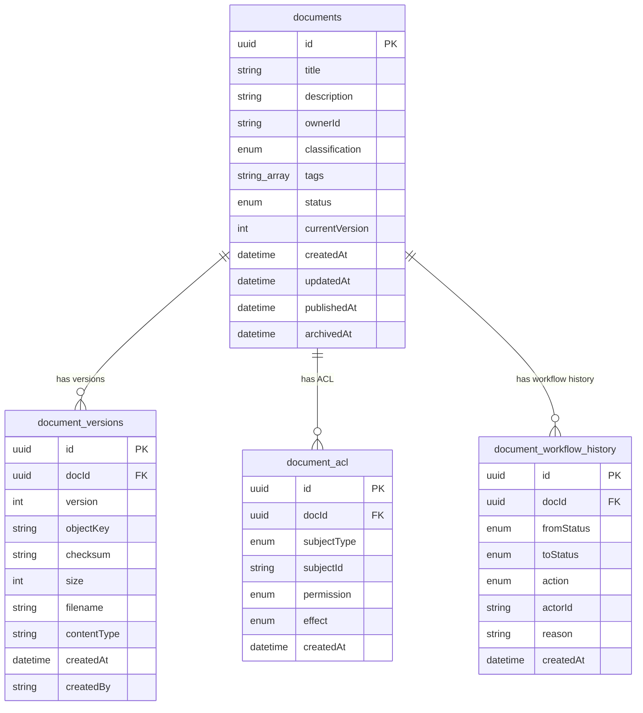
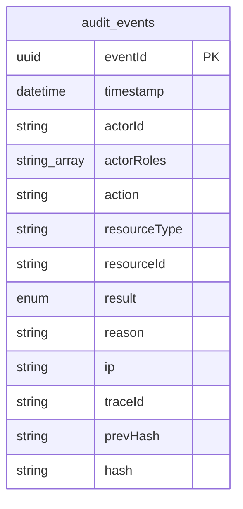
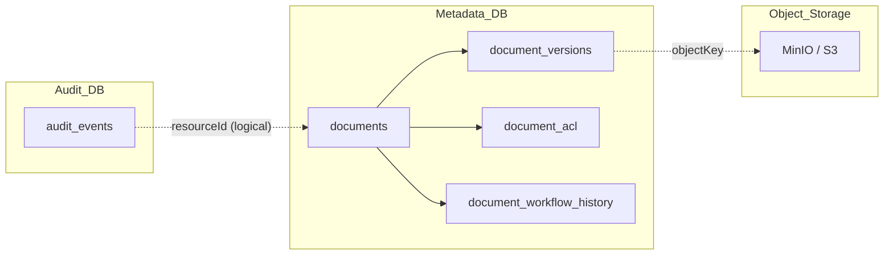

# DocVault ERD

Cập nhật: 2026-03-15

Tài liệu này mô tả Entity-Relationship Diagram của DocVault, đồng bộ với định hướng triển khai **MVP** hiện tại theo kiến trúc **microservices**.

---

## 1. Design Principles

### 1.1. Tổng quan kiến trúc dữ liệu

| Layer | Sở hữu bởi | Chứa gì |
|---|---|---|
| **Metadata DB** (`docvault_metadata`) | `metadata-service` | documents, document_versions, document_acl, document_workflow_history |
| **Audit DB** (`docvault_audit`) | `audit-service` | audit_events (append-only, tamper-evident) |
| **Object Storage** (MinIO / S3) | `document-service` | Blob file thực tế, được tham chiếu qua `document_versions.objectKey` |

### 1.2. Nguyên tắc thiết kế

- **Tách biệt metadata và blob**: Postgres giữ metadata + pointer, MinIO giữ nội dung file.
- **Service boundary rõ ràng**: Mỗi service sở hữu DB riêng, không cross-query trực tiếp.
- **Loose coupling cho audit**: `audit_events` không dùng FK cứng sang `documents` để giữ boundary append-only và cho phép audit-service scale độc lập.
- **External identity**: `ownerId`, `actorId`, `subjectId` là reference tới Keycloak, không có bảng `users` nội bộ.
- **MVP-first**: Thiết kế đủ dùng cho implementation thực tế, tránh over-engineer.

### 1.3. Giải thích quyết định thiết kế

| Quyết định | Lý do |
|---|---|
| Workflow MVP không có trạng thái `APPROVED` riêng | APPROVE là **action** chuyển từ PENDING → PUBLISHED. Gộp để giảm độ phức tạp state machine. Khi cần multi-step approval, có thể thêm sau. |
| `tags` dùng `text[]` (PostgreSQL array) | Đơn giản cho MVP, không cần bảng join `document_tags`. Hỗ trợ GIN index để query hiệu quả. |
| `audit_events` không FK sang `documents` | Audit-service là bounded context riêng, append-only. `resourceId` lưu documentId/versionId dạng string, cho phép audit cả resource ngoài documents. |
| Cần `document_workflow_history` ngoài `audit_events` | Audit trail ghi mọi event hệ thống (upload, download, login...), còn workflow history chỉ ghi chuyển trạng thái nghiệp vụ. Workflow history thuộc metadata-service, phục vụ truy vết nhanh lịch sử duyệt mà không cần cross-service query. |
| `currentVersion` là `Int` | Đủ cho MVP. Tương lai có thể nâng cấp thành `currentVersionId` (UUID FK) nếu cần trỏ chính xác version record. |

---

## 2. Main Entities

### 2.1. `documents`

**Service owner**: metadata-service

**Mục đích**: Source-of-truth cho document metadata. Mỗi record đại diện cho một tài liệu logic trong hệ thống.

#### Columns

| Column | Type | Constraints | Mô tả |
|---|---|---|---|
| `id` | `UUID` | PK, auto-generated | Khóa chính |
| `title` | `String` | NOT NULL | Tên tài liệu |
| `description` | `String?` | nullable | Mô tả ngắn |
| `ownerId` | `String` | NOT NULL | Keycloak user ID của người sở hữu |
| `classification` | `ClassificationLevel` | NOT NULL, default `INTERNAL` | Mức phân loại bảo mật |
| `tags` | `String[]` | default `[]` | Tags phân loại, lưu dạng PostgreSQL text array |
| `status` | `DocumentStatus` | NOT NULL, default `DRAFT` | Trạng thái hiện tại |
| `currentVersion` | `Int` | NOT NULL, default `0` | Version pointer hiện hành |
| `createdAt` | `DateTime` | NOT NULL, auto | Thời điểm tạo |
| `updatedAt` | `DateTime` | NOT NULL, auto | Thời điểm cập nhật cuối |
| `publishedAt` | `DateTime?` | nullable | Thời điểm được publish (set khi APPROVE) |
| `archivedAt` | `DateTime?` | nullable | Thời điểm archive |

#### Enums

**`DocumentStatus`**:
- `DRAFT` — tài liệu mới tạo hoặc bị reject quay về
- `PENDING` — đã submit, đang chờ duyệt
- `PUBLISHED` — đã được approve và publish
- `ARCHIVED` — đã archive, read-only

**`ClassificationLevel`**:
- `PUBLIC` — công khai
- `INTERNAL` — nội bộ (mặc định)
- `CONFIDENTIAL` — mật
- `SECRET` — tuyệt mật

#### Indexes

- `@@index([ownerId])` — query documents theo owner
- `@@index([status])` — filter theo trạng thái
- `@@index([tags], type: Gin)` — GIN index cho full-array search trên PostgreSQL

#### Notes

- `currentVersion` tăng monotonically khi upload version mới.
- `publishedAt` được set một lần khi document chuyển sang PUBLISHED, **không reset** nếu document bị archive rồi re-publish (nếu có flow đó trong tương lai).
- `classification` hiện tại là enum. Nếu cần dynamic classification levels, có thể chuyển sang lookup table sau.

---

### 2.2. `document_versions`

**Service owner**: metadata-service

**Mục đích**: Lưu version pointer cho mỗi phiên bản file đã upload. Mỗi version trỏ tới một blob object trong MinIO.

#### Columns

| Column | Type | Constraints | Mô tả |
|---|---|---|---|
| `id` | `UUID` | PK, auto-generated | Khóa chính |
| `docId` | `UUID` | FK → `documents.id`, ON DELETE CASCADE | Document cha |
| `version` | `Int` | NOT NULL | Số thứ tự version |
| `objectKey` | `String` | NOT NULL | Key trong MinIO, format: `doc/{docId}/v{n}/{filename}` |
| `checksum` | `String` | NOT NULL | SHA-256 hash của file |
| `size` | `Int` | NOT NULL | Kích thước file (bytes) |
| `filename` | `String` | NOT NULL | Tên file gốc khi upload |
| `contentType` | `String?` | nullable | MIME type |
| `createdAt` | `DateTime` | NOT NULL, auto | Thời điểm tạo version |
| `createdBy` | `String` | NOT NULL | Keycloak user ID của người tạo |

#### Constraints

- `@@unique([docId, version])` — mỗi document chỉ có một version number duy nhất
- `@@index([docId, createdAt])` — query versions theo document, sắp xếp theo thời gian

#### Notes

- `objectKey` là con trỏ logic sang MinIO. Xóa record không tự xóa blob (cần background job hoặc lifecycle policy).
- `createdBy` có thể khác `documents.ownerId` nếu người khác upload version mới.

---

### 2.3. `document_acl`

**Service owner**: metadata-service

**Mục đích**: Lưu chính sách truy cập (Access Control List) theo từng document. Hỗ trợ cấp/cấm quyền cho user, role, group, hoặc toàn bộ.

#### Columns

| Column | Type | Constraints | Mô tả |
|---|---|---|---|
| `id` | `UUID` | PK, auto-generated | Khóa chính |
| `docId` | `UUID` | FK → `documents.id`, ON DELETE CASCADE | Document áp dụng |
| `subjectType` | `AclSubjectType` | NOT NULL | Loại chủ thể |
| `subjectId` | `String?` | nullable | ID của user/role/group. NULL khi `subjectType = ALL` |
| `permission` | `DocumentPermission` | NOT NULL | Quyền được cấp/cấm |
| `effect` | `AclEffect` | NOT NULL | Cho phép hoặc từ chối |
| `createdAt` | `DateTime` | NOT NULL, auto | Thời điểm tạo rule |

#### Enums

**`AclSubjectType`**:
- `USER` — một user cụ thể (subjectId = Keycloak user ID)
- `ROLE` — một role (subjectId = role name)
- `GROUP` — một group Keycloak (subjectId = group ID)
- `ALL` — toàn bộ (subjectId = NULL)

**`DocumentPermission`**:
- `READ` — xem metadata + nội dung
- `DOWNLOAD` — tải file
- `WRITE` — chỉnh sửa metadata, upload version mới
- `APPROVE` — quyền duyệt document

**`AclEffect`**:
- `ALLOW` — cho phép
- `DENY` — từ chối (ưu tiên cao hơn ALLOW khi evaluate)

#### Indexes

- `@@index([docId, permission])` — lookup quyền theo document
- `@@index([subjectType, subjectId])` — lookup rule theo subject

#### Notes

- Khi evaluate ACL: DENY luôn thắng ALLOW (deny-overrides strategy).
- `subjectId` là generic string để tương thích với nhiều loại identity từ Keycloak.

---

### 2.4. `document_workflow_history`

**Service owner**: metadata-service (được gọi bởi workflow-service)

**Mục đích**: Lưu lịch sử chuyển trạng thái nghiệp vụ của document. Cho phép truy vết ai đã submit/approve/reject, khi nào, và lý do.

> **Đây là bảng mới**, bổ sung cho MVP để hỗ trợ truy vết workflow mà không cần cross-service query sang audit-service.

#### Columns

| Column | Type | Constraints | Mô tả |
|---|---|---|---|
| `id` | `UUID` | PK, auto-generated | Khóa chính |
| `docId` | `UUID` | FK → `documents.id`, ON DELETE CASCADE | Document liên quan |
| `fromStatus` | `DocumentStatus` | NOT NULL | Trạng thái trước |
| `toStatus` | `DocumentStatus` | NOT NULL | Trạng thái sau |
| `action` | `WorkflowAction` | NOT NULL | Hành động thực hiện |
| `actorId` | `String` | NOT NULL | Keycloak user ID của người thực hiện |
| `reason` | `String?` | nullable | Lý do (bắt buộc khi REJECT, tùy chọn khi khác) |
| `createdAt` | `DateTime` | NOT NULL, auto | Thời điểm thực hiện |

#### Enums

**`WorkflowAction`**:
- `SUBMIT` — gửi duyệt (DRAFT → PENDING)
- `APPROVE` — duyệt (PENDING → PUBLISHED)
- `REJECT` — từ chối (PENDING → DRAFT)
- `ARCHIVE` — lưu trữ (PUBLISHED → ARCHIVED)

#### Indexes

- `@@index([docId, createdAt])` — truy vấn lịch sử workflow theo document, sắp xếp thời gian

#### Notes

- Bảng này phục vụ truy vết nghiệp vụ nhanh (ai duyệt? ai reject? lý do?).
- Khác với `audit_events` (ghi mọi event hệ thống), bảng này chỉ ghi chuyển trạng thái workflow.
- `reason` nên bắt buộc ở tầng application khi `action = REJECT`.

---

### 2.5. `audit_events`

**Service owner**: audit-service

**Mục đích**: Bảng append-only lưu audit trail toàn hệ thống. Hỗ trợ tamper-evident qua hash chain.

#### Columns

| Column | Type | Constraints | Mô tả |
|---|---|---|---|
| `eventId` | `UUID` | PK, auto-generated | Khóa chính |
| `timestamp` | `DateTime` | NOT NULL, auto | Thời điểm event |
| `actorId` | `String` | NOT NULL | Keycloak user ID |
| `actorRoles` | `String[]` | NOT NULL | Roles của actor tại thời điểm event |
| `action` | `String` | NOT NULL | Hành động: `UPLOAD`, `UPDATE_METADATA`, `DOWNLOAD`, `SUBMIT`, `APPROVE`, `REJECT`, `ARCHIVE`, ... |
| `resourceType` | `String` | NOT NULL | Loại resource: `DOCUMENT`, `VERSION`, `ACL`, ... |
| `resourceId` | `String?` | nullable | ID của resource (documentId, versionId, ...) |
| `result` | `AuditResult` | NOT NULL | Kết quả của action |
| `reason` | `String?` | nullable | Lý do (nếu có) |
| `ip` | `String?` | nullable | IP address của request |
| `traceId` | `String?` | nullable | Distributed trace ID xuyên services |
| `prevHash` | `String?` | nullable | Hash của event trước đó. NULL cho event đầu tiên |
| `hash` | `String` | NOT NULL | Hash của event hiện tại |

#### Enums

**`AuditResult`**:
- `SUCCESS` — thao tác thành công
- `DENY` — bị từ chối (ACL, auth)
- `CONFLICT` — conflict (duplicate version, etc.)
- `ERROR` — lỗi hệ thống

#### Indexes

- `@@index([actorId, timestamp])` — tra cứu theo actor
- `@@index([action, timestamp])` — tra cứu theo loại action
- `@@index([resourceType, resourceId])` — tra cứu theo resource
- `@@index([result, timestamp])` — filter theo kết quả

#### Notes — Tamper-Evident Hash Chain

- **Append-only**: Không cho phép UPDATE hoặc DELETE record. Enforce bằng application logic và DB permissions.
- **Hash chain**:
  - `hash` = `SHA-256(eventId + timestamp + actorId + action + resourceType + resourceId + result + prevHash)`
  - `prevHash` trỏ tới `hash` của event ngay trước đó (theo thứ tự insert).
  - Event đầu tiên có `prevHash = NULL`.
- **Phát hiện tampering**: Một background job hoặc on-demand API có thể duyệt chuỗi và verify rằng mỗi `hash` khớp với dữ liệu + `prevHash`. Nếu bất kỳ record nào bị sửa, chuỗi hash sẽ bị đứt.
- **Không dùng FK sang documents**: `resourceId` là string reference, không enforce FK. Điều này giữ audit-service loosely coupled và cho phép ghi audit cho cả resource không thuộc metadata DB.

---

## 3. Relationships

### 3.1. Metadata DB — Quan hệ giữa các bảng

```text
documents (1) ──< (N) document_versions
documents (1) ──< (N) document_acl
documents (1) ──< (N) document_workflow_history
```

- Mỗi `document` có thể có nhiều `document_versions` (versioning).
- Mỗi `document` có thể có nhiều `document_acl` entries (ACL rules).
- Mỗi `document` có thể có nhiều `document_workflow_history` records (lịch sử chuyển trạng thái).
- Tất cả FK đều `ON DELETE CASCADE` — xóa document sẽ xóa toàn bộ versions, ACL, và workflow history.

### 3.2. Cross-boundary — Object Storage

```text
document_versions.objectKey ──> MinIO object (doc/{docId}/v{n}/{filename})
```

- Đây là quan hệ logic, không phải FK trong DB.
- `document-service` quản lý upload/download blob.
- `metadata-service` chỉ lưu pointer (`objectKey`).

### 3.3. Cross-boundary — Audit

```text
audit_events.resourceId ──> documents.id (logical, không FK)
audit_events.resourceId ──> document_versions.id (logical, không FK)
```

- `resourceType` xác định loại resource mà `resourceId` tham chiếu.
- Không có FK cứng để giữ audit-service independent.

---

## 4. Workflow Mapping

### 4.1. State Machine MVP

```text
┌───────┐   SUBMIT    ┌─────────┐   APPROVE   ┌───────────┐   ARCHIVE   ┌──────────┐
│ DRAFT │ ──────────→  │ PENDING │ ──────────→  │ PUBLISHED │ ──────────→ │ ARCHIVED │
└───────┘              └─────────┘              └───────────┘             └──────────┘
    ↑                       │
    └───────────────────────┘
              REJECT
```

### 4.2. Transition Rules

| From | To | Action | Ghi chú |
|---|---|---|---|
| `DRAFT` | `PENDING` | `SUBMIT` | Owner hoặc user có quyền WRITE submit |
| `PENDING` | `PUBLISHED` | `APPROVE` | User có quyền APPROVE duyệt. Set `publishedAt`. |
| `PENDING` | `DRAFT` | `REJECT` | User có quyền APPROVE từ chối. Yêu cầu `reason`. |
| `PUBLISHED` | `ARCHIVED` | `ARCHIVE` | Owner hoặc admin archive. Set `archivedAt`. |

### 4.3. Lưu ý MVP

- **Không có trạng thái `APPROVED` riêng**: Trong MVP, hành động APPROVE chuyển thẳng từ PENDING → PUBLISHED. Nếu tương lai cần multi-step approval (ví dụ: PENDING → APPROVED → PUBLISHED), có thể thêm trạng thái mới.
- Mỗi chuyển trạng thái tạo một record trong `document_workflow_history` **và** một event trong `audit_events`.

---

## 5. Indexing and Constraints

### 5.1. Unique Constraints

| Bảng | Constraint | Mục đích |
|---|---|---|
| `document_versions` | `UNIQUE(docId, version)` | Đảm bảo không trùng version number trong cùng document |

### 5.2. Indexes

| Bảng | Index | Type | Mục đích |
|---|---|---|---|
| `documents` | `(ownerId)` | B-tree | Query documents theo owner |
| `documents` | `(status)` | B-tree | Filter theo trạng thái |
| `documents` | `(tags)` | GIN | Full-array contains search cho tags |
| `document_versions` | `(docId, createdAt)` | B-tree | List versions theo thời gian |
| `document_acl` | `(docId, permission)` | B-tree | Lookup quyền theo document |
| `document_acl` | `(subjectType, subjectId)` | B-tree | Lookup rule theo subject |
| `document_workflow_history` | `(docId, createdAt)` | B-tree | Truy vấn lịch sử workflow |
| `audit_events` | `(actorId, timestamp)` | B-tree | Tra cứu theo actor |
| `audit_events` | `(action, timestamp)` | B-tree | Tra cứu theo action |
| `audit_events` | `(resourceType, resourceId)` | B-tree | Tra cứu theo resource |
| `audit_events` | `(result, timestamp)` | B-tree | Filter theo kết quả |

### 5.3. Danh sách Enum tổng hợp

| Enum Name | Values | Sử dụng tại |
|---|---|---|
| `DocumentStatus` | `DRAFT`, `PENDING`, `PUBLISHED`, `ARCHIVED` | `documents.status`, `document_workflow_history.fromStatus/toStatus` |
| `ClassificationLevel` | `PUBLIC`, `INTERNAL`, `CONFIDENTIAL`, `SECRET` | `documents.classification` |
| `AclSubjectType` | `USER`, `ROLE`, `GROUP`, `ALL` | `document_acl.subjectType` |
| `DocumentPermission` | `READ`, `DOWNLOAD`, `WRITE`, `APPROVE` | `document_acl.permission` |
| `AclEffect` | `ALLOW`, `DENY` | `document_acl.effect` |
| `WorkflowAction` | `SUBMIT`, `APPROVE`, `REJECT`, `ARCHIVE` | `document_workflow_history.action` |
| `AuditResult` | `SUCCESS`, `DENY`, `CONFLICT`, `ERROR` | `audit_events.result` |

---

## 6. MVP Scope and Future Enhancements

### 6.1. MVP hiện tại bao gồm

- ✅ 4 bảng metadata: `documents`, `document_versions`, `document_acl`, `document_workflow_history`
- ✅ 1 bảng audit: `audit_events` (append-only, tamper-evident)
- ✅ Workflow state machine 4 trạng thái
- ✅ Tags dạng text array
- ✅ ACL hỗ trợ USER / ROLE / GROUP / ALL
- ✅ Hash chain cho audit

### 6.2. Tương lai có thể mở rộng

| Enhancement | Mô tả |
|---|---|
| `currentVersionId` (UUID FK) | Thay `currentVersion` (Int) bằng FK trỏ thẳng tới `document_versions.id` |
| Multi-step approval | Thêm trạng thái `APPROVED` giữa PENDING và PUBLISHED |
| Workflow rules engine | Bảng `workflow_rules` định nghĩa transition rules dynamic |
| Retention policy | Bảng `retention_policies` auto-archive/delete documents theo thời gian |
| Policy engine | Tách ACL thành policy engine riêng (OPA, Casbin) |
| External search index | Sync metadata sang Elasticsearch/Meilisearch |
| Document categories | Bảng `categories` với tree structure thay vì chỉ dùng tags |
| Notification preferences | Bảng lưu notification settings cho từng user |
| `document_tags` join table | Nếu cần tag normalization, chuyển từ text[] sang bảng riêng |

---

## 7. Service Ownership Map

| Service | Sở hữu DB | Sở hữu Storage |
|---|---|---|
| **metadata-service** | `documents`, `document_versions`, `document_acl`, `document_workflow_history` | — |
| **audit-service** | `audit_events` | — |
| **document-service** | — | MinIO objects (referenced by `objectKey`) |
| **workflow-service** | — (stateless, gọi metadata-service) | — |
| **notification-service** | — (stateless, MVP chỉ log) | — |
| **gateway** | — (stateless, auth + routing) | — |

### Ràng buộc nghiệp vụ

- `compliance_officer` có thể đọc metadata và audit nhưng không được download blob.
- Download authorization được quyết định bởi `metadata-service` (ACL check).
- `document-service` không tự quyết policy download.
- `workflow-service` không tự lưu metadata, chỉ update trạng thái qua `metadata-service`.
- `audit-service` không FK sang metadata DB — giữ boundary append-only và loosely coupled.

---

## 8. Mermaid ER Diagram

### 8.1. Metadata DB



### 8.2. Audit DB



### 8.3. Quan hệ logic cross-boundary


