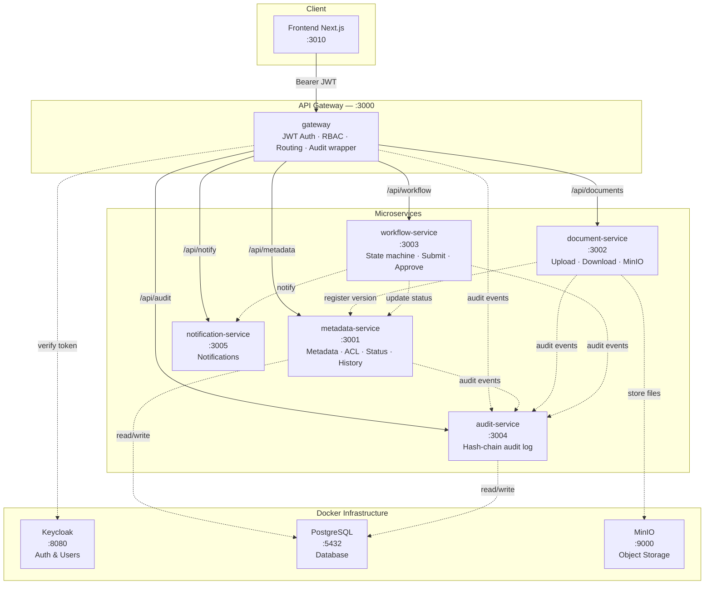
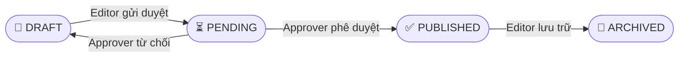
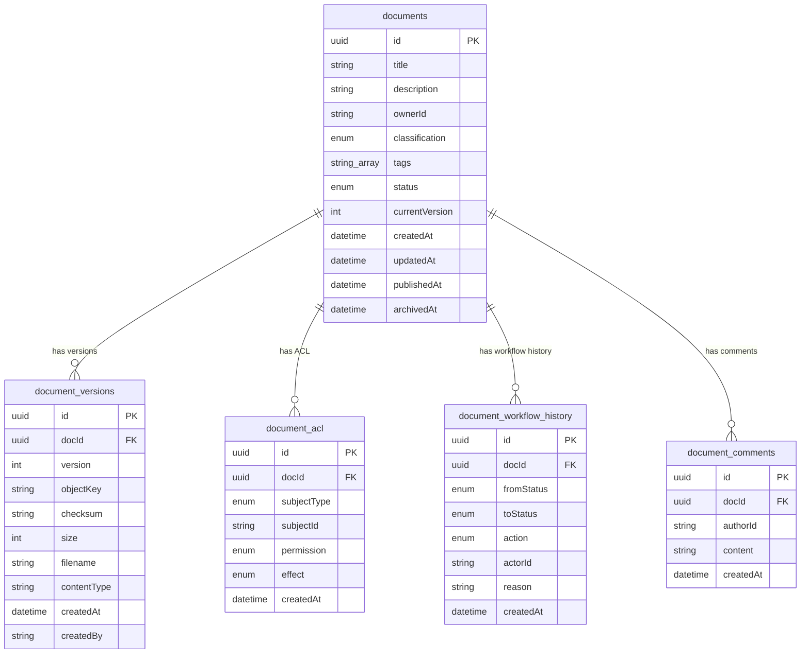

# 📦 Hướng dẫn sử dụng — Hệ thống DocVault

> **DocVault** là hệ thống quản lý tài liệu doanh nghiệp được xây dựng trên kiến trúc **microservices** sử dụng NestJS (backend) và Next.js (frontend). Hệ thống hỗ trợ toàn bộ vòng đời tài liệu: **Tạo → Tải lên → Duyệt → Xuất bản → Lưu trữ**, với phân quyền theo vai trò (RBAC), phân loại bảo mật, và nhật ký kiểm toán chống giả mạo (tamper-evident audit log).

---

## 📑 Mục lục

- [Tổng quan kiến trúc](#-tổng-quan-kiến-trúc)
- [Yêu cầu cài đặt](#-yêu-cầu-cài-đặt)
- [Hướng dẫn chạy dự án](#-hướng-dẫn-chạy-dự-án)
- [Tài khoản demo](#-tài-khoản-demo)
- [Vai trò & Phân quyền](#-vai-trò--phân-quyền)
- [Vòng đời tài liệu](#-vòng-đời-tài-liệu)
- [Luồng nghiệp vụ chính](#-luồng-nghiệp-vụ-chính)
- [Giao diện Frontend](#-giao-diện-frontend)
- [API Reference](#-api-reference)
- [Mô hình dữ liệu](#-mô-hình-dữ-liệu)
- [Tính năng nâng cao](#-tính-năng-nâng-cao)
- [Kiểm thử](#-kiểm-thử)
- [Xử lý sự cố](#-xử-lý-sự-cố)
- [Cấu trúc thư mục](#-cấu-trúc-thư-mục)
- [Lưu ý quan trọng](#-lưu-ý-quan-trọng)

---

## 🏗 Tổng quan kiến trúc

### Sơ đồ tổng thể



### Thành phần hệ thống

| Thành phần | Port | Công nghệ | Vai trò |
|---|:---:|---|---|
| **Frontend** | 3010 | Next.js 15, React 19, TanStack Query, Tailwind CSS 4 | Giao diện người dùng |
| **Gateway** | 3000 | NestJS | Điểm vào duy nhất, xác thực JWT, phân quyền, proxy routing |
| **metadata-service** | 3001 | NestJS + Prisma | Quản lý metadata tài liệu, ACL, trạng thái, lịch sử |
| **document-service** | 3002 | NestJS + AWS S3 SDK | Tải lên/tải xuống file qua MinIO |
| **workflow-service** | 3003 | NestJS | Máy trạng thái duyệt tài liệu |
| **audit-service** | 3004 | NestJS + Prisma | Nhật ký kiểm toán với chuỗi hash SHA-256 |
| **notification-service** | 3005 | NestJS | Thông báo (hiện tại là sink đơn giản) |
| **PostgreSQL** | 5432 | PostgreSQL | Cơ sở dữ liệu chính |
| **MinIO** | 9000 | MinIO (S3-compatible) | Lưu trữ file tài liệu |
| **Keycloak** | 8080 | Keycloak | Quản lý danh tính & xác thực |

### Luồng xử lý request

```
Client → Gateway (:3000) → Backend Services (:3001–:3005)
                      ↓
            JWT verification (Keycloak JWKS)
            Role-based routing
            Audit event emission
```

- Gateway **không chứa business logic** — chỉ routing, xác thực và ghi audit.
- Mỗi service tự verify JWT trực tiếp với Keycloak qua JWKS.
- Các service giao tiếp nội bộ qua **HTTP (Axios)**, không sử dụng message queue.

---

## 💻 Yêu cầu cài đặt

| Công cụ | Phiên bản tối thiểu |
|---|---|
| **Node.js** | 18+ (khuyến nghị 20+) |
| **pnpm** | 9+ |
| **Docker Desktop** | 24+ |
| **Git** | Bất kỳ |

### Các port cần để trống

| Port | Dùng cho |
|:---:|---|
| 3000 | Gateway |
| 3001 | metadata-service |
| 3002 | document-service |
| 3003 | workflow-service |
| 3004 | audit-service |
| 3005 | notification-service |
| 3010 | Frontend |
| 5432 | PostgreSQL |
| 8080 | Keycloak |
| 9000 | MinIO API |
| 9001 | MinIO Console |

---

## 🚀 Hướng dẫn chạy dự án

### Cách 1 — Chạy nhanh bằng một lệnh (khuyến nghị)

> ⚠️ Cần khởi động Docker Infrastructure trước (Bước 2 trong hướng dẫn chi tiết).

```bash
pnpm start:sequential
```

Script này tự động khởi động **tất cả backend services theo đúng thứ tự**, kiểm tra health endpoint trước khi chạy service tiếp theo:

```
metadata-service (:3001) → document-service (:3002) → workflow-service (:3003)
  → notification-service (:3005) → audit-service (:3004) → gateway (:3000)
```

**Tùy chọn bổ sung:**

```bash
# Chạy kèm Prisma migration (lần đầu hoặc khi thay đổi schema)
RUN_PRISMA_DEPLOY=1 pnpm start:sequential

# Tùy chỉnh timeout health-check
SERVICE_HEALTH_TIMEOUT_MS=180000 pnpm start:sequential
```

Sau khi backend chạy xong, khởi động frontend riêng:

```bash
pnpm --filter web dev -- --port 3010
```

### Cách 2 — Chạy bằng PowerShell script (Windows)

```powershell
# Khởi động tất cả services (mỗi service mở trong cửa sổ riêng)
.\start-all.ps1

# Dừng tất cả services
.\start-all.ps1 -StopAll
```

### Cách 3 — Hướng dẫn chi tiết từng bước

#### Bước 1 — Cài đặt dependencies

```bash
pnpm install
```

#### Bước 2 — Khởi động hạ tầng Docker

Lệnh này khởi động: **PostgreSQL**, **MinIO**, **Keycloak** (kèm realm seed & tài khoản mẫu).

```bash
docker compose -f infra/docker-compose.dev.yml --env-file infra/.env.example up -d
```

Đợi tất cả container **healthy** (khoảng 30–60 giây):

```bash
docker compose -f infra/docker-compose.dev.yml ps
```

> **Sau khi khởi động:**
> - PostgreSQL: `localhost:5432`
> - MinIO Console: [http://localhost:9001](http://localhost:9001) — đăng nhập: `minioadmin` / `minioadminpw`
> - Keycloak Admin: [http://localhost:8080](http://localhost:8080) — đăng nhập: `admin` / `adminpw`

#### Bước 3 — Chạy Database Migrations

```bash
# metadata-service (PostgreSQL)
pnpm --filter metadata-service prisma:deploy

# audit-service (PostgreSQL)
pnpm --filter audit-service prisma:deploy
```

#### Bước 4 — Khởi động Backend Services

Mỗi service chạy trong một terminal riêng, **theo đúng thứ tự**:

```bash
# Terminal 1 — metadata-service (port 3001)
pnpm --filter metadata-service start:dev

# Terminal 2 — document-service (port 3002)
pnpm --filter document-service start:dev

# Terminal 3 — workflow-service (port 3003)
pnpm --filter workflow-service start:dev

# Terminal 4 — audit-service (port 3004)
pnpm --filter audit-service start:dev

# Terminal 5 — notification-service (port 3005)
pnpm --filter notification-service start:dev

# Terminal 6 — gateway (port 3000) — KHỞI ĐỘNG SAU CÙNG
pnpm --filter gateway start:dev
```

> ⚠️ **Lưu ý:** Gateway phải khởi động **sau** khi tất cả service khác đã sẵn sàng.

**Kiểm tra health:**

```
http://localhost:3000/health   ← Gateway
http://localhost:3001/health   ← metadata-service
http://localhost:3002/health   ← document-service
http://localhost:3003/health   ← workflow-service
http://localhost:3004/health   ← audit-service
http://localhost:3005/health   ← notification-service
```

#### Bước 5 — Khởi động Frontend

```bash
pnpm --filter web dev -- --port 3010
```

Mở trình duyệt: [http://localhost:3010](http://localhost:3010)

---

## 👥 Tài khoản demo

Tất cả tài khoản đều đã được tạo sẵn (seed) trong Keycloak.

**Mật khẩu chung:** `Passw0rd!`

| Tài khoản | Vai trò | Mô tả |
|---|---|---|
| `viewer1` | Viewer | Xem danh sách, xem trước & tải xuống tài liệu đã xuất bản |
| `editor1` | Editor | Tạo, tải file lên, gửi duyệt, lưu trữ tài liệu |
| `approver1` | Approver | Phê duyệt / từ chối tài liệu |
| `co1` | Compliance Officer | Xem audit log, **không thể tải xuống file** |
| `admin1` | Admin | Toàn quyền |

### Đăng nhập

Frontend hỗ trợ 2 chế độ đăng nhập:

1. **Đăng nhập qua Keycloak** — chuyển hướng đến trang đăng nhập Keycloak, sử dụng tài khoản ở trên
2. **Nhập JWT Token** — dán token thủ công (dùng cho testing API)

### Lấy JWT Token từ Keycloak (CLI)

```bash
curl -s -X POST \
  http://localhost:8080/realms/docvault/protocol/openid-connect/token \
  -H "Content-Type: application/x-www-form-urlencoded" \
  -d "client_id=docvault-gateway&client_secret=dev-gateway-secret&grant_type=password&username=editor1&password=Passw0rd!" \
  | jq -r '.access_token'
```

Thay `editor1` bằng username khác để lấy token cho vai trò tương ứng.

---

## 🔐 Vai trò & Phân quyền

### Ma trận quyền theo vai trò

| Chức năng | Viewer | Editor | Approver | CO | Admin |
|---|:---:|:---:|:---:|:---:|:---:|
| Xem danh sách tài liệu | ✅ | ✅ | ✅ | ✅ | ✅ |
| Xem chi tiết tài liệu | ✅ | ✅ | ✅ | ✅ | ✅ |
| Tạo tài liệu mới | ❌ | ✅ | ❌ | ❌ | ✅ |
| Tải file lên | ❌ | ✅ | ❌ | ❌ | ✅ |
| Quản lý ACL | ❌ | ✅¹ | ❌ | ❌ | ✅ |
| Gửi duyệt (Submit) | ❌ | ✅¹ | ❌ | ❌ | ✅ |
| Phê duyệt (Approve) | ❌ | ❌ | ✅ | ❌ | ✅ |
| Từ chối (Reject) | ❌ | ❌ | ✅ | ❌ | ✅ |
| Lưu trữ (Archive) | ❌ | ✅¹ | ❌ | ❌ | ✅ |
| Tải xuống file | ✅ | ✅ | ✅ | ❌ | ✅ |
| Xem trước tài liệu | ✅ | ✅ | ✅ | ✅² | ✅ |
| Xem audit log | ❌ | ❌ | ❌ | ✅ | ✅ |
| Trang "Tài liệu của tôi" | ❌ | ✅ | ❌ | ❌ | ✅ |

> ¹ Chỉ cho tài liệu mà Editor là chủ sở hữu (owner).
> ² CO chỉ xem trước được tài liệu phân loại **PUBLIC**.

### Phân loại bảo mật × Hiển thị

Hệ thống hỗ trợ 4 mức phân loại bảo mật:

| Phân loại | Mô tả | Ai thấy trong danh sách? |
|---|---|---|
| `PUBLIC` | Công khai | Tất cả vai trò |
| `INTERNAL` | Nội bộ | Editor, Approver, CO, Admin |
| `CONFIDENTIAL` | Bảo mật | Approver, CO, Admin |
| `SECRET` | Tuyệt mật | Approver, CO, Admin |

> **Ngoại lệ:** Người dùng luôn thấy tài liệu mà mình **sở hữu** hoặc có **ACL entry**, bất kể mức phân loại.

### Quy tắc xem trước (Preview)

| Phân loại | Viewer | Editor | Approver | CO | Admin |
|---|:---:|:---:|:---:|:---:|:---:|
| `PUBLIC` | ✅ | ✅ | ✅ | ✅ | ✅ |
| `INTERNAL` | ✅ | ✅ | ✅ | ❌ | ✅ |
| `CONFIDENTIAL` | ❌ | ✅¹ | ✅ | ❌ | ✅ |
| `SECRET` | ❌ | ❌ | ✅ | ❌ | ✅ |

> ¹ Yêu cầu ACL rõ ràng hoặc là chủ sở hữu.

---

## 🔄 Vòng đời tài liệu



| Chuyển trạng thái | Hành động | Ai thực hiện | Ghi chú |
|---|---|---|---|
| DRAFT → PENDING | `SUBMIT` | Editor (chủ sở hữu), Admin | Gửi tài liệu duyệt |
| PENDING → PUBLISHED | `APPROVE` | Approver, Admin | Tự động set `publishedAt` |
| PENDING → DRAFT | `REJECT` | Approver, Admin | Cần ghi lý do (reason) |
| PUBLISHED → ARCHIVED | `ARCHIVE` | Editor (chủ sở hữu), Admin | Tự động set `archivedAt` |

**Sau mỗi chuyển trạng thái:**
- Ghi một bản ghi vào `document_workflow_history`
- Phát một audit event
- Gửi thông báo (nếu có)

---

## 💼 Luồng nghiệp vụ chính

### 1. Tạo & Xuất bản tài liệu

```
Editor                       Gateway              Services
  │                             │                    │
  ├─ POST /api/metadata/documents ──────────────► │ Tạo metadata (DRAFT)
  ├─ POST /api/documents/:id/upload ────────────► │ Upload file lên MinIO
  ├─ POST /api/workflow/:id/submit ─────────────► │ DRAFT → PENDING
  │                                                │
Approver                                           │
  ├─ POST /api/workflow/:id/approve ────────────► │ PENDING → PUBLISHED
  │                                                │
Viewer                                             │
  └─ POST /api/documents/:id/presign-download ──► │ Lấy URL tải xuống
```

**Chi tiết từng bước:**

1. **Editor** tạo tài liệu mới (`POST /api/metadata/documents`) → trạng thái `DRAFT`
2. **Editor** tải file lên (`POST /api/documents/:id/upload`) → file lưu vào MinIO, tạo bản ghi version
3. **Editor** gửi duyệt (`POST /api/workflow/:id/submit`) → trạng thái chuyển sang `PENDING`
4. **Approver** phê duyệt (`POST /api/workflow/:id/approve`) → trạng thái chuyển sang `PUBLISHED`
5. **Viewer/Editor** có thể tải xuống file đã xuất bản

### 2. Tải xuống file (Download Flow)

Quy trình tải xuống gồm **2 bước** để đảm bảo an toàn:

```
1. metadata-service kiểm tra quyền → ký grant token (short-lived)
2. document-service xác minh token → trả file (presigned URL hoặc stream)
```

**Quy tắc tải xuống:**
- Chỉ tài liệu `PUBLISHED` mới cho tải xuống
- `compliance_officer` **luôn bị chặn** tải xuống, bất kể ACL
- ACL `DENY` cho quyền `DOWNLOAD` sẽ chặn tải
- Chủ sở hữu tài liệu luôn có thể tải

### 3. Luồng Compliance Officer

```
Compliance Officer   Gateway         metadata-service
  │                    │                    │
  ├─ GET /api/metadata/documents ──────────► │ Xem danh sách → 200 ✅
  ├─ GET /api/audit/query ─────────────────► │ Xem audit log → 200 ✅
  └─ POST /api/documents/:id/presign-download │ Tải file → 403 ❌ (luôn bị chặn)
```

### 4. Hệ thống Watermark khi tải xuống

Tài liệu có phân loại **CONFIDENTIAL** hoặc **SECRET** khi tải xuống dưới dạng PDF sẽ tự động được đóng watermark bao gồm:
- Tên người tải
- Thời gian tải
- Mức phân loại bảo mật

---

## 🖥 Giao diện Frontend

### Các màn hình chính

| Màn hình | URL | Mô tả |
|---|---|---|
| **Đăng nhập** | `/login` | Đăng nhập qua Keycloak hoặc JWT Token |
| **Dashboard** | `/dashboard` | Tổng quan trạng thái tài liệu, thống kê nhanh |
| **Danh sách tài liệu** | `/documents` | Bảng tài liệu với bộ lọc, tìm kiếm, sắp xếp |
| **Chi tiết tài liệu** | `/documents/:id` | Metadata, versions, workflow timeline, ACL, comments |
| **Tạo tài liệu mới** | `/documents/new` | Form tạo tài liệu với upload file |
| **Phê duyệt** | `/approvals` | Danh sách tài liệu PENDING chờ duyệt (Approver/Admin) |
| **Audit Log** | `/audit` | Nhật ký kiểm toán (Compliance Officer/Admin) |
| **Tài liệu của tôi** | `/my-documents` | Tài liệu do mình tạo (Editor/Admin) |
| **Cài đặt** | `/settings` | Cài đặt người dùng |
| **Hồ sơ** | `/profile` | Thông tin cá nhân |

### Tính năng giao diện

- 🌙 **Dark mode** — hỗ trợ giao diện tối với hệ thống design token nhất quán
- 🔍 **Tìm kiếm server-side** — tìm theo title, description, tags (PostgreSQL ILIKE)
- 📋 **Bulk Actions** — chọn nhiều tài liệu và thao tác hàng loạt
- 💬 **Comments** — bình luận/ghi chú trên tài liệu
- 👁 **Preview** — xem trước PDF bằng pdf.js (canvas, không có nút download)
- ⚡ **Micro-animations** — hiệu ứng chuyển động mượt mà
- 📱 **Responsive** — tương thích đa thiết bị

---

## 📡 API Reference

> Base URL: `http://localhost:3000/api`
> Header bắt buộc: `Authorization: Bearer <keycloak_jwt>`

### Bảng tổng hợp API

| Method | Endpoint | Vai trò | Mô tả |
|---|---|---|---|
| GET | `/metadata/documents` | Tất cả | Danh sách tài liệu |
| GET | `/metadata/documents?q=keyword` | Tất cả | Tìm kiếm tài liệu |
| POST | `/metadata/documents` | Editor, Admin | Tạo tài liệu mới |
| GET | `/metadata/documents/:docId` | Tất cả | Chi tiết tài liệu (kèm versions, ACL) |
| PATCH | `/metadata/documents/:docId` | Editor¹, Admin | Cập nhật metadata |
| GET | `/metadata/documents/:docId/workflow-history` | Tất cả | Lịch sử workflow |
| POST | `/metadata/documents/:docId/acl` | Editor, Admin | Thêm/cập nhật ACL |
| GET | `/metadata/documents/:docId/acl` | Editor, Approver, CO, Admin | Xem danh sách ACL |
| POST | `/metadata/documents/:docId/download-authorize` | Tất cả (CO bị chặn) | Yêu cầu grant token tải xuống |
| GET | `/metadata/documents/:docId/comments` | Tất cả | Xem bình luận |
| POST | `/metadata/documents/:docId/comments` | Tất cả | Thêm bình luận |
| POST | `/documents/:docId/upload` | Editor, Admin | Upload file (multipart/form-data) |
| POST | `/documents/:docId/presign-download` | Viewer, Editor, Approver, Admin | Lấy presigned URL |
| GET | `/documents/:docId/versions/:version/stream` | Viewer, Editor, Approver, Admin | Stream file trực tiếp |
| POST | `/workflow/:docId/submit` | Editor, Admin | Gửi duyệt (DRAFT → PENDING) |
| POST | `/workflow/:docId/approve` | Approver, Admin | Phê duyệt (PENDING → PUBLISHED) |
| POST | `/workflow/:docId/reject` | Approver, Admin | Từ chối (PENDING → DRAFT) |
| POST | `/workflow/:docId/archive` | Editor¹, Admin | Lưu trữ (PUBLISHED → ARCHIVED) |
| GET | `/audit/query` | CO, Admin | Truy vấn audit log |

> ¹ Chỉ chủ sở hữu (owner) tài liệu.

### Swagger UI

Khi services đang chạy, truy cập Swagger UI để xem chi tiết API:

| Service | URL |
|---|---|
| Gateway | [http://localhost:3000/docs](http://localhost:3000/docs) |
| metadata-service | [http://localhost:3001/docs](http://localhost:3001/docs) |
| document-service | [http://localhost:3002/docs](http://localhost:3002/docs) |
| workflow-service | [http://localhost:3003/docs](http://localhost:3003/docs) |
| audit-service | [http://localhost:3004/docs](http://localhost:3004/docs) |
| notification-service | [http://localhost:3005/docs](http://localhost:3005/docs) |

### Mã lỗi phổ biến

| HTTP Code | Ý nghĩa |
|:---:|---|
| 400 | Request body không hợp lệ |
| 401 | Thiếu / sai / hết hạn JWT token |
| 403 | Không đủ quyền (sai vai trò hoặc ACL bị chặn) |
| 404 | Tài liệu không tồn tại |
| 409 | Xung đột (ví dụ: duyệt tài liệu đã được duyệt) |

---

## 🗄 Mô hình dữ liệu

### Tổng quan databases

| Database | Service sở hữu | Nội dung |
|---|---|---|
| `docvault_metadata` (PostgreSQL) | metadata-service | documents, document_versions, document_acl, document_workflow_history, document_comments |
| `docvault_audit` (PostgreSQL) | audit-service | audit_events (append-only, tamper-evident) |
| MinIO (S3) | document-service | File blob thực tế |

### ER Diagram



### Audit Events & Hash Chain

Bảng `audit_events` sử dụng **chuỗi hash SHA-256** để chống giả mạo:

```
hash = SHA-256(prevHash + "|" + canonicalPayload)
```

- Mỗi event mới liên kết với hash của event trước đó
- Nếu bất kỳ bản ghi nào bị sửa đổi, chuỗi hash sẽ bị phá vỡ → phát hiện được
- Bảng này là **append-only** — không cho phép UPDATE hoặc DELETE

### Enums

| Enum | Giá trị | Sử dụng ở |
|---|---|---|
| `DocumentStatus` | `DRAFT`, `PENDING`, `PUBLISHED`, `ARCHIVED` | documents.status |
| `ClassificationLevel` | `PUBLIC`, `INTERNAL`, `CONFIDENTIAL`, `SECRET` | documents.classification |
| `AclSubjectType` | `USER`, `ROLE`, `GROUP`, `ALL` | document_acl.subjectType |
| `DocumentPermission` | `READ`, `DOWNLOAD`, `WRITE`, `APPROVE` | document_acl.permission |
| `AclEffect` | `ALLOW`, `DENY` | document_acl.effect |
| `WorkflowAction` | `SUBMIT`, `APPROVE`, `REJECT`, `ARCHIVE` | document_workflow_history.action |

---

## ⚙ Tính năng nâng cao

### Bulk Actions (Thao tác hàng loạt)

Chọn nhiều tài liệu trong bảng và thao tác đồng thời:

| Hành động | Mô tả |
|---|---|
| **Bulk Submit** | Chọn nhiều DRAFT → Gửi duyệt tất cả |
| **Bulk Approve** | Chọn nhiều PENDING → Phê duyệt hàng loạt |
| **Bulk Archive** | Chọn nhiều PUBLISHED → Lưu trữ đồng thời |

> Kết quả hiển thị qua toast: `"Bulk Submit: 3 thành công, 1 thất bại"`.

### Document Comments (Bình luận)

- Tất cả vai trò có quyền xem tài liệu đều có thể bình luận
- Hiển thị ở cột phải trên trang chi tiết tài liệu
- API: `GET/POST /api/metadata/documents/:docId/comments`

### Full-text Search (Tìm kiếm server-side)

- Tìm theo tiêu đề, mô tả và tags
- Xử lý phía server (PostgreSQL ILIKE) → hiệu quả với tập dữ liệu lớn
- API: `GET /api/metadata/documents?q=keyword`
- Frontend tự động gửi truy vấn khi gõ vào ô tìm kiếm

### My Documents (Tài liệu của tôi)

- Trang riêng `/my-documents` dành cho Editor/Admin
- Tự động lọc theo `ownerId` — chỉ hiện tài liệu mình tạo
- Hỗ trợ đầy đủ: bulk actions, bộ lọc, submit/archive

### ACL (Access Control List)

Hệ thống ACL hỗ trợ kiểm soát truy cập chi tiết:

| Subject Type | Mô tả |
|---|---|
| `USER` | Một người dùng cụ thể |
| `ROLE` | Một vai trò (tất cả user có vai trò đó) |
| `GROUP` | Một nhóm Keycloak |
| `ALL` | Tất cả |

| Permission | Mô tả |
|---|---|
| `READ` | Xem metadata + nội dung |
| `DOWNLOAD` | Tải file xuống |
| `WRITE` | Sửa metadata, upload version mới |
| `APPROVE` | Phê duyệt tài liệu |

| Effect | Mô tả |
|---|---|
| `ALLOW` | Cho phép |
| `DENY` | Từ chối (**ưu tiên hơn ALLOW**) |

### Document Preview (Xem trước tài liệu)

- Hỗ trợ xem trước tài liệu ở trạng thái `PUBLISHED` và `ARCHIVED`
- PDF được render bằng **pdf.js** (canvas) — không có nút download, không right-click save
- Tài liệu ARCHIVED chỉ cho xem trước, **không cho tải xuống**

---

## 🧪 Kiểm thử

### E2E Smoke Test

Chạy kiểm thử tự động toàn bộ luồng backend:

```bash
pnpm test:e2e
```

**Các kịch bản kiểm thử:**

| # | Kịch bản | Kết quả mong đợi |
|:---:|---|---|
| 1 | Request không có token | 401 Unauthorized |
| 2 | Token hết hạn | 401 Unauthorized |
| 3 | Viewer tạo tài liệu | 403 Forbidden |
| 4 | Editor tạo + upload | 201 Created ✅ |
| 5 | Viewer tải draft | 403 Forbidden |
| 6 | Editor gửi duyệt | PENDING ✅ |
| 7 | Approver phê duyệt | PUBLISHED ✅ |
| 8 | Phê duyệt lần 2 | 409 Conflict |
| 9 | Viewer tải file PUBLISHED | 200 OK ✅ |
| 10 | CO tải file | 403 Forbidden |
| 11 | CO xem audit log | 200 OK ✅ |
| 12 | Viewer xem audit log | 403 Forbidden |

### Unit Tests

```bash
# Chạy tất cả unit tests
pnpm test

# Chạy test một service cụ thể
pnpm --filter metadata-service test

# Chạy một file test cụ thể
pnpm --filter metadata-service test -- --testPathPattern=foo.spec.ts
```

### Xem dữ liệu (GUI Tools)

| Công cụ | URL | Đăng nhập |
|---|---|---|
| **Prisma Studio** (PostgreSQL) | [http://localhost:5555](http://localhost:5555) | — |
| **MinIO Console** | [http://localhost:9001](http://localhost:9001) | `minioadmin` / `minioadminpw` |
| **Keycloak Admin** | [http://localhost:8080](http://localhost:8080) | `admin` / `adminpw` |

Mở Prisma Studio:

```bash
pnpm --filter metadata-service prisma:studio
```

---

## 🔧 Xử lý sự cố

### ❌ Lỗi Postgres Migration

**Triệu chứng:** `prisma:deploy` báo lỗi.

**Kiểm tra:**
- Container Postgres đã healthy chưa
- Database `docvault_metadata` và `docvault_audit` đã được tạo
- Nếu có volume cũ từ lần chạy trước, xóa volume và tạo lại

```bash
docker compose -f infra/docker-compose.dev.yml down -v
docker compose -f infra/docker-compose.dev.yml --env-file infra/.env.example up -d
```

### ❌ Frontend không gọi được API

**Triệu chứng:** Giao diện hiện lỗi khi tải dữ liệu.

**Kiểm tra:**
- File `apps/web/.env.local` có cấu hình đúng: `NEXT_PUBLIC_API_BASE_URL=http://localhost:3000/api`
- Gateway đang chạy trên port 3000
- Frontend chạy trên port khác (3010), **không phải** 3000

### ❌ Không lấy được token Keycloak

**Triệu chứng:** Curl trả về lỗi khi lấy JWT token.

**Kiểm tra:**
- Keycloak đang chạy tại `http://localhost:8080`
- Realm `docvault` đã được import (seed tự động)
- Client secret trong `.env` khớp với seed hiện tại (`dev-gateway-secret`)

### ❌ Port bị conflict

**Triệu chứng:** Service không khởi động được, báo port already in use.

**Xử lý:**
- Kiểm tra xem port nào đang bị chiếm: `netstat -ano | findstr :<port>`
- Dừng process đang chiếm port hoặc đổi port trong cấu hình

---

## 📁 Cấu trúc thư mục

```
docvault/
├── apps/
│   └── web/                        # Frontend Next.js 15
│       └── src/
│           ├── app/                # App Router pages
│           │   ├── (app)/          # Các trang cần đăng nhập
│           │   │   ├── dashboard/      # Tổng quan
│           │   │   ├── documents/      # Danh sách & chi tiết tài liệu
│           │   │   ├── my-documents/   # Tài liệu của tôi
│           │   │   ├── approvals/      # Trang phê duyệt
│           │   │   ├── audit/          # Nhật ký kiểm toán
│           │   │   ├── settings/       # Cài đặt
│           │   │   └── profile/        # Hồ sơ
│           │   └── (auth)/         # Trang đăng nhập
│           ├── components/         # UI components
│           ├── features/           # Feature modules
│           ├── lib/                # Utilities, hooks, auth
│           ├── providers/          # React context providers
│           └── types/              # TypeScript types
│
├── services/
│   ├── gateway/                    # API Gateway (NestJS, port 3000)
│   ├── metadata-service/           # Metadata & ACL management (port 3001)
│   ├── document-service/           # Upload/Download via MinIO (port 3002)
│   ├── workflow-service/           # Máy trạng thái duyệt (port 3003)
│   ├── audit-service/              # Nhật ký kiểm toán (port 3004)
│   └── notification-service/       # Thông báo (port 3005)
│
├── infra/
│   ├── docker-compose.dev.yml      # Docker: Postgres, MinIO, Keycloak
│   ├── .env.example                # Cấu hình mẫu cho Docker
│   ├── db/                         # Script bootstrap Postgres
│   ├── keycloak/                   # Realm config & seed users
│   └── minio/                      # Script tạo bucket MinIO
│
├── libs/
│   ├── auth/                       # Shared auth primitives
│   ├── contracts/                  # OpenAPI spec & event schemas
│   └── throttler/                  # Rate limiting utility
│
├── scripts/
│   ├── e2e-check.mjs              # Script kiểm thử E2E
│   ├── start-sequential.mjs       # Script khởi động tuần tự
│   └── demo.sh                    # Script demo
│
├── docs/
│   ├── API_CONTRACT.md            # Chi tiết API endpoints
│   ├── ERD.md                     # Entity Relationship Diagram
│   ├── PROJECT_STATUS.md          # Trạng thái dự án
│   ├── RUN_PROJECT.md             # Hướng dẫn chạy chi tiết
│   └── verification-report.md    # Báo cáo kiểm tra tích hợp
│
├── images/                        # Hình ảnh kiến trúc & use case
├── start-all.ps1                  # PowerShell script khởi động (Windows)
├── package.json                   # Root workspace config
├── pnpm-workspace.yaml            # pnpm workspace definition
└── turbo.json                     # Turbo build config
```

---

## ⚠ Lưu ý quan trọng

1. **Compliance Officer (CO)** luôn bị chặn tải file xuống, dù ACL cho phép. Logic nằm trong `metadata-service/src/policy/policy.service.ts`. CO chỉ xem trước được tài liệu **PUBLIC**, nhưng thấy metadata (chi tiết) cho tất cả tài liệu PUBLISHED và ARCHIVED.

2. **Approver** là quyền cao nhất sau Admin — có thể xem trước tài liệu ở **mọi** mức phân loại bảo mật.

3. **Archive** chỉ dành cho Editor chủ sở hữu hoặc Admin (Approver không có quyền này). Tài liệu ARCHIVED chỉ cho **xem trước**, không cho tải xuống.

4. **Thứ tự khởi động** rất quan trọng: Gateway phải khởi động **sau cùng**, sau khi tất cả backend services đã sẵn sàng.

5. **ACL: DENY ưu tiên hơn ALLOW** — nếu cùng tài liệu có cả rule ALLOW và DENY, DENY sẽ được áp dụng.

6. **Gateway tự động ghi audit** cho mọi request nhận được.

7. **Download có watermark** — file PDF với phân loại CONFIDENTIAL/SECRET sẽ được đóng watermark khi tải xuống.

---

## 📄 Tài liệu liên quan

| Tài liệu | Đường dẫn |
|---|---|
| README gốc (Tiếng Anh) | [`README.md`](../README.md) |
| API Contract chi tiết | [`API_CONTRACT.md`](API_CONTRACT.md) |
| Entity Relationship Diagram | [`ERD.md`](ERD.md) |
| Trạng thái dự án | [`PROJECT_STATUS.md`](PROJECT_STATUS.md) |
| Hướng dẫn chạy chi tiết | [`RUN_PROJECT.md`](RUN_PROJECT.md) |
| Báo cáo kiểm tra tích hợp | [`verification-report.md`](verification-report.md) |
| Cấu hình Infrastructure | [`../infra/README.md`](../infra/README.md) |
