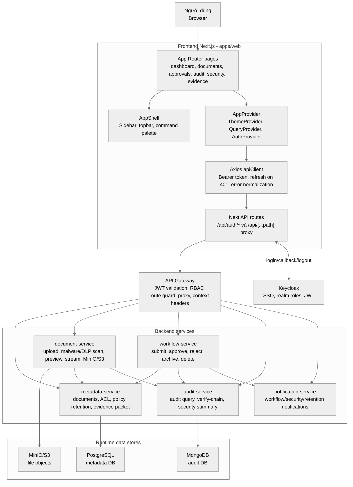
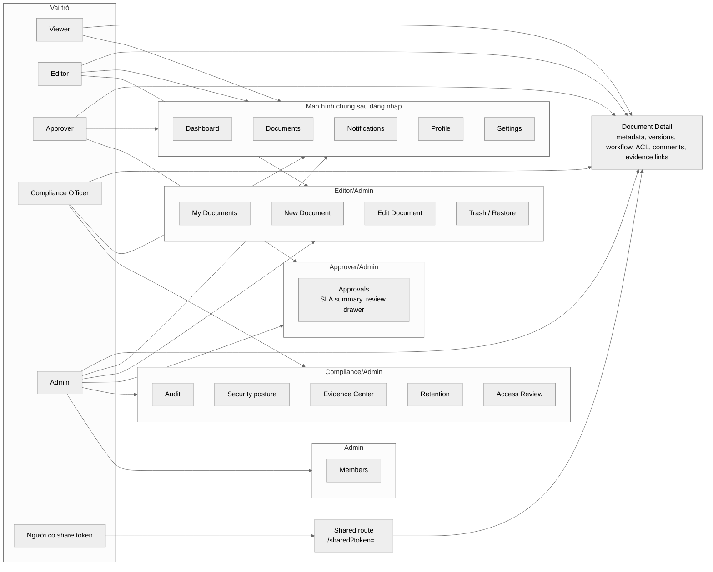
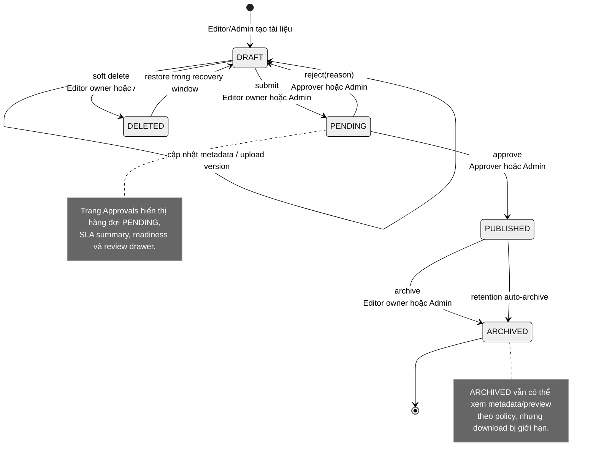
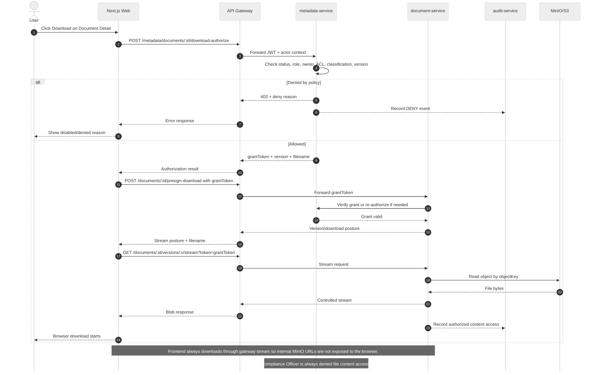
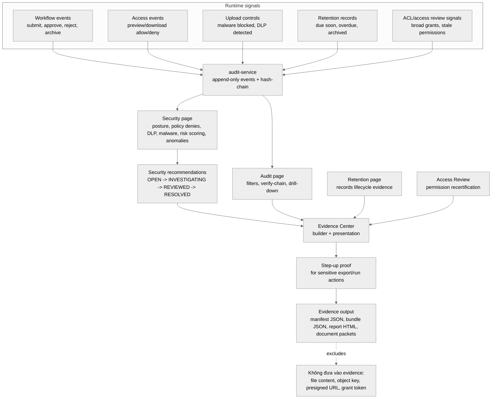
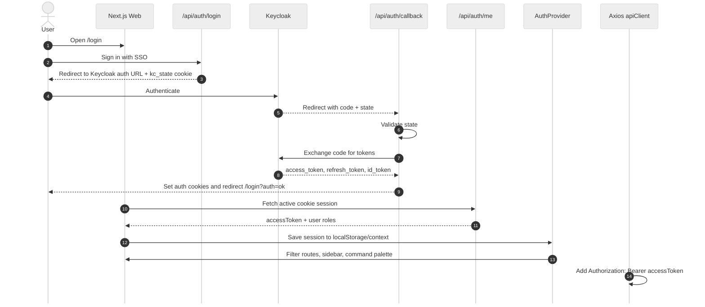
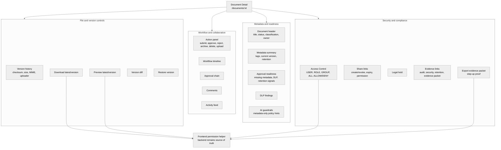

# Hướng dẫn vẽ và chèn sơ đồ web vào báo cáo DocVault

Tài liệu này hướng dẫn vẽ các sơ đồ nên bổ sung cho phần web/runtime của DocVault, không bao gồm pipeline DevSecOps.

Report LaTeX đã cấu hình `\graphicspath` trỏ tới `../docs/images/web/`, nên sau khi render Mermaid, hãy đặt file ảnh PNG vào:

```text
docs/images/web/
```

Khi chèn vào LaTeX, chỉ cần dùng tên file, ví dụ:

```tex
\includegraphics[width=\textwidth]{web-runtime-architecture.png}
```

## Quy trình chung

1. Tạo thư mục chứa source Mermaid:

```powershell
New-Item -ItemType Directory -Force docs\diagrams\web
```

2. Với mỗi sơ đồ bên dưới, lưu phần Mermaid vào file `.mmd`, ví dụ:

```text
docs/diagrams/web/01-web-runtime-architecture.mmd
```

3. Render ra PNG bằng Mermaid CLI:

```powershell
pnpm dlx @mermaid-js/mermaid-cli -i docs/diagrams/web/01-web-runtime-architecture.mmd -o docs/images/web/web-runtime-architecture.png -t neutral -b white -s 2
```

Nếu không muốn dùng CLI, có thể mở Mermaid Live Editor, dán code Mermaid, export PNG, rồi lưu đúng tên file trong `docs/images/web/`.

4. Chèn snippet LaTeX tương ứng vào file chương được gợi ý.

5. Build lại report và kiểm tra `\listoffigures` tự cập nhật.

## Danh sách hình nên thêm

| STT | File PNG | Vị trí nên chèn | Mục đích |
| --- | --- | --- | --- |
| 1 | `web-runtime-architecture.png` | `report/chapters/05_trien_khai_ung_dung.tex`, sau đoạn giới thiệu Frontend Next.js | Giải thích web app kết nối Auth, API client, gateway và service backend như thế nào. |
| 2 | `web-role-screen-map.png` | `report/chapters/03_phan_tich_thiet_ke.tex`, sau bảng tác nhân hoặc phần yêu cầu chức năng | Thể hiện màn hình/chức năng theo từng vai trò. |
| 3 | `document-lifecycle-state.png` | `report/chapters/04_du_lieu_api_bao_mat.tex`, thay block `lstlisting` vòng đời tài liệu | Trình bày state machine rõ hơn dạng text. |
| 4 | `download-authorization-sequence.png` | `report/chapters/04_du_lieu_api_bao_mat.tex`, thay block `lstlisting` download authorization | Làm rõ grant token, policy check và stream qua gateway. |
| 5 | `compliance-evidence-flow.png` | `report/chapters/05_trien_khai_ung_dung.tex` hoặc `07_kiem_thu_danh_gia.tex` | Làm rõ Audit, Security, Evidence, Retention, Access Review liên kết thế nào. |
| 6 | `sso-session-sequence.png` | `report/chapters/05_trien_khai_ung_dung.tex`, phần Frontend hoặc Auth | Bổ sung luồng SSO Keycloak và session frontend. |
| 7 | `document-detail-composition.png` | `report/chapters/05_trien_khai_ung_dung.tex`, sau đoạn mô tả Document Detail | Cho thấy trang chi tiết tài liệu không chỉ là xem metadata mà là trung tâm nghiệp vụ. |

## 1. Kiến trúc web runtime

Lưu thành:

```text
docs/diagrams/web/01-web-runtime-architecture.mmd
```

Render:

```powershell
pnpm dlx @mermaid-js/mermaid-cli -i docs/diagrams/web/01-web-runtime-architecture.mmd -o docs/images/web/web-runtime-architecture.png -t neutral -b white -s 2
```

Mermaid:



Chèn vào LaTeX:

```tex
\begin{figure}[H]
\centering
\includegraphics[width=\textwidth]{web-runtime-architecture.png}
\caption{Kiến trúc runtime của frontend DocVault}
\label{fig:web-runtime-architecture}
\end{figure}
```

## 2. Sơ đồ role và màn hình web

Lưu thành:

```text
docs/diagrams/web/02-web-role-screen-map.mmd
```

Render:

```powershell
pnpm dlx @mermaid-js/mermaid-cli -i docs/diagrams/web/02-web-role-screen-map.mmd -o docs/images/web/web-role-screen-map.png -t neutral -b white -s 2
```

Mermaid:



Chèn vào LaTeX:

```tex
\begin{figure}[H]
\centering
\includegraphics[width=\textwidth]{web-role-screen-map.png}
\caption{Phân quyền truy cập màn hình web theo vai trò}
\label{fig:web-role-screen-map}
\end{figure}
```

## 3. State machine vòng đời tài liệu

Lưu thành:

```text
docs/diagrams/web/03-document-lifecycle-state.mmd
```

Render:

```powershell
pnpm dlx @mermaid-js/mermaid-cli -i docs/diagrams/web/03-document-lifecycle-state.mmd -o docs/images/web/document-lifecycle-state.png -t neutral -b white -s 2
```

Mermaid:



Chèn vào LaTeX:

```tex
\begin{figure}[H]
\centering
\includegraphics[width=0.9\textwidth]{document-lifecycle-state.png}
\caption{State machine vòng đời tài liệu trong DocVault}
\label{fig:document-lifecycle-state}
\end{figure}
```

Gợi ý: hình này nên thay cho block `lstlisting` hiện tại trong section `Document lifecycle`.

## 4. Sequence diagram download authorization

Lưu thành:

```text
docs/diagrams/web/04-download-authorization-sequence.mmd
```

Render:

```powershell
pnpm dlx @mermaid-js/mermaid-cli -i docs/diagrams/web/04-download-authorization-sequence.mmd -o docs/images/web/download-authorization-sequence.png -t neutral -b white -s 2
```

Mermaid:



Chèn vào LaTeX:

```tex
\begin{figure}[H]
\centering
\includegraphics[width=\textwidth]{download-authorization-sequence.png}
\caption{Luồng cấp quyền và tải file qua grant token}
\label{fig:download-authorization-sequence}
\end{figure}
```

Gợi ý: hình này nên thay cho block `lstlisting` trong section `Thiết kế preview/download authorization`.

## 5. Luồng compliance evidence của web

Lưu thành:

```text
docs/diagrams/web/05-compliance-evidence-flow.mmd
```

Render:

```powershell
pnpm dlx @mermaid-js/mermaid-cli -i docs/diagrams/web/05-compliance-evidence-flow.mmd -o docs/images/web/compliance-evidence-flow.png -t neutral -b white -s 2
```

Mermaid:



Chèn vào LaTeX:

```tex
\begin{figure}[H]
\centering
\includegraphics[width=\textwidth]{compliance-evidence-flow.png}
\caption{Luồng tổng hợp bằng chứng tuân thủ trong web runtime}
\label{fig:compliance-evidence-flow}
\end{figure}
```

## 6. Sequence diagram SSO và session frontend

Sơ đồ này là bổ sung. Nên dùng nếu muốn giải thích vì sao frontend có thể lấy role, lọc menu và gắn Bearer token cho API.

Lưu thành:

```text
docs/diagrams/web/06-sso-session-sequence.mmd
```

Render:

```powershell
pnpm dlx @mermaid-js/mermaid-cli -i docs/diagrams/web/06-sso-session-sequence.mmd -o docs/images/web/sso-session-sequence.png -t neutral -b white -s 2
```

Mermaid:



Chèn vào LaTeX:

```tex
\begin{figure}[H]
\centering
\includegraphics[width=\textwidth]{sso-session-sequence.png}
\caption{Luồng SSO Keycloak và khởi tạo session frontend}
\label{fig:sso-session-sequence}
\end{figure}
```

## 7. Sơ đồ cấu trúc Document Detail

Sơ đồ này là bổ sung nhưng rất đáng có vì trang `/documents/[id]` là màn hình trung tâm của phần web.

Lưu thành:

```text
docs/diagrams/web/07-document-detail-composition.mmd
```

Render:

```powershell
pnpm dlx @mermaid-js/mermaid-cli -i docs/diagrams/web/07-document-detail-composition.mmd -o docs/images/web/document-detail-composition.png -t neutral -b white -s 2
```

Mermaid:



Chèn vào LaTeX:

```tex
\begin{figure}[H]
\centering
\includegraphics[width=\textwidth]{document-detail-composition.png}
\caption{Các khối nghiệp vụ trong màn hình chi tiết tài liệu}
\label{fig:document-detail-composition}
\end{figure}
```

## Gợi ý chèn vào các chương

### Chương 3 - Phân tích yêu cầu và thiết kế tổng thể

Nên thêm:

- `web-role-screen-map.png` sau bảng tác nhân chính.

Lý do: chương này đang nói về actor và yêu cầu chức năng, nên sơ đồ role-to-screen giúp nối actor với giao diện.

### Chương 4 - Thiết kế dữ liệu, API và chính sách bảo mật

Nên thay hai block `lstlisting` bằng hình:

- `document-lifecycle-state.png`
- `download-authorization-sequence.png`

Lý do: hai nội dung này là state machine và sequence, thể hiện bằng sơ đồ sẽ rõ hơn text.

### Chương 5 - Triển khai ứng dụng DocVault

Nên thêm:

- `web-runtime-architecture.png` sau đoạn giới thiệu frontend Next.js.
- `sso-session-sequence.png` nếu muốn làm rõ đăng nhập SSO.
- `document-detail-composition.png` sau đoạn mô tả Document Detail.
- `compliance-evidence-flow.png` sau phần Audit/Security/Evidence/Retention hoặc trước phần screenshot.

Lý do: chương này hiện có screenshot, nhưng thiếu sơ đồ giải thích web app vận hành như một runtime có policy, workflow và evidence.

### Chương 7 - Kiểm thử, đánh giá và bằng chứng

Có thể dùng lại:

- `compliance-evidence-flow.png`

Lý do: nếu chương 7 nhấn mạnh evidence, sơ đồ này giải thích nguồn evidence từ runtime trước khi trình bày ảnh/bảng kiểm thử.

## Lưu ý chất lượng hình

- Ưu tiên PNG nền trắng để in báo cáo dễ đọc.
- Nếu hình quá nhỏ trong PDF, render lại với `-s 3` hoặc tăng width/height:

```powershell
pnpm dlx @mermaid-js/mermaid-cli -i docs/diagrams/web/04-download-authorization-sequence.mmd -o docs/images/web/download-authorization-sequence.png -t neutral -b white -s 3
```

- Không nên chèn Mermaid source trực tiếp vào LaTeX hiện tại, vì report đang dùng `graphicx`, không cấu hình package render Mermaid.
- Đặt `\label{...}` ngay sau `\caption{...}` để reference đúng.
- Caption nên mô tả ý nghĩa nghiệp vụ, không chỉ ghi tên kỹ thuật.
- Nếu một sơ đồ quá rộng, dùng:

```tex
\includegraphics[width=\textwidth]{ten-hinh.png}
```

- Nếu sơ đồ state machine nhỏ hơn, dùng:

```tex
\includegraphics[width=0.85\textwidth]{ten-hinh.png}
```

## Thứ tự nên làm

Nếu thời gian hạn chế, làm trước 4 hình này:

1. `web-runtime-architecture.png`
2. `document-lifecycle-state.png`
3. `download-authorization-sequence.png`
4. `compliance-evidence-flow.png`

Sau đó bổ sung `web-role-screen-map.png`, `sso-session-sequence.png`, và `document-detail-composition.png` nếu báo cáo còn chỗ.
