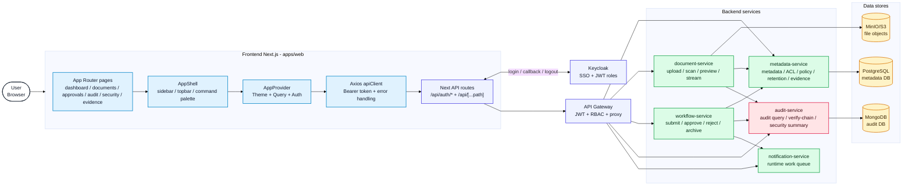
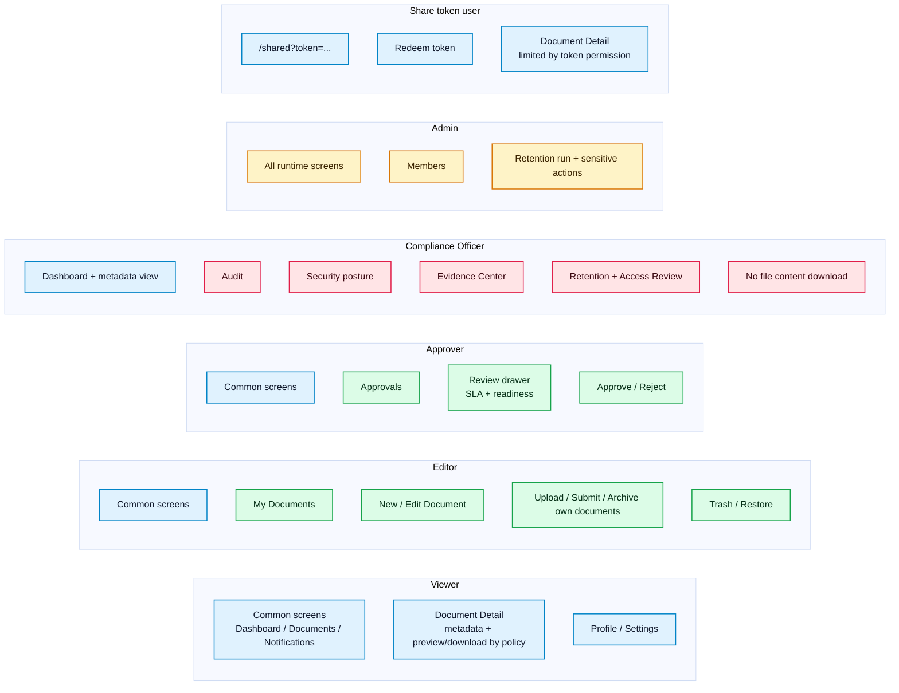
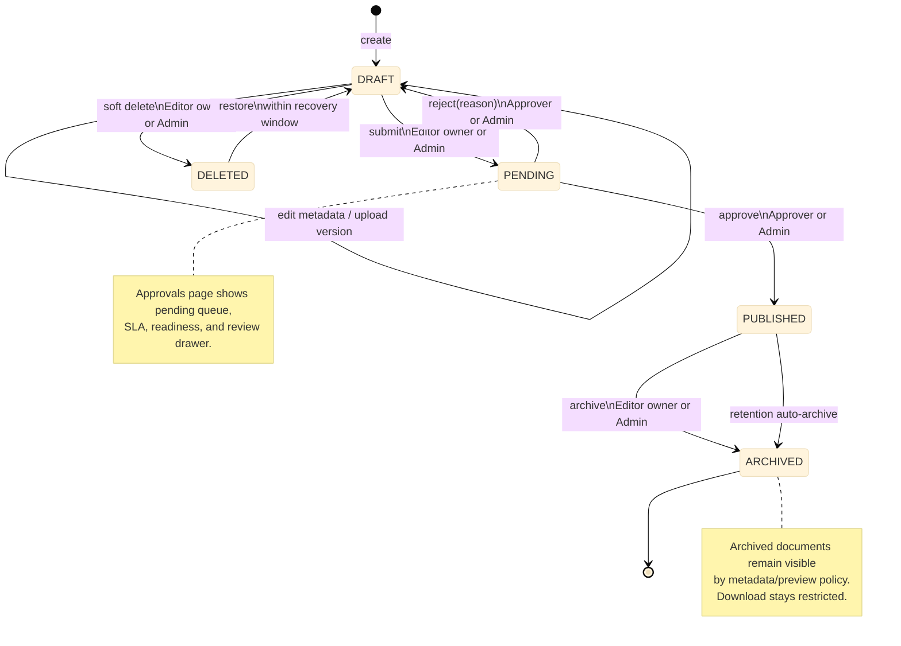
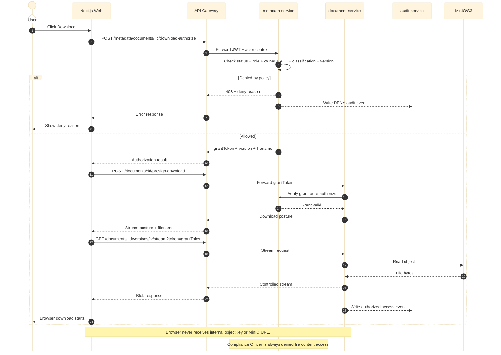
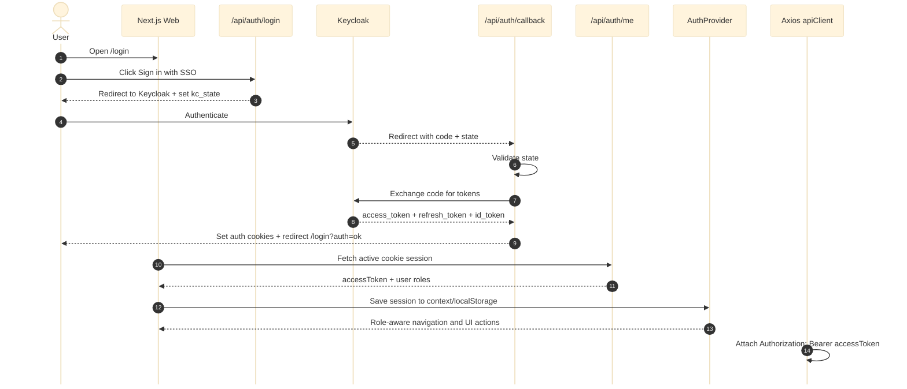

```mermaid
%%{init: {"theme": "base", "flowchart": {"curve": "linear", "htmlLabels": true}}}%%
flowchart LR
  classDef signal fill:#E0F2FE,stroke:#0284C7,stroke-width:1.5px,color:#0F172A;
  classDef audit fill:#FFE4E6,stroke:#E11D48,stroke-width:1.5px,color:#3B0710;
  classDef surface fill:#EEF2FF,stroke:#4F46E5,stroke-width:1.5px,color:#111827;
  classDef output fill:#FEF3C7,stroke:#D97706,stroke-width:1.5px,color:#3B2400;
  classDef deny fill:#FEE2E2,stroke:#DC2626,stroke-width:1.5px,color:#450A0A;

  subgraph SIG["1. Runtime signals"]
    direction TB
    WFE["Workflow events<br/>submit / approve / reject / archive"]:::signal
    ACE["Access events<br/>preview/download allow or deny"]:::signal
    UPE["Upload controls<br/>malware blocked / DLP detected"]:::signal
    RTE["Retention records<br/>due soon / overdue / archived"]:::signal
    ACRE["ACL review signals<br/>broad grants / stale permissions"]:::signal
  end

  AUD["2. audit-service<br/>append-only events + hash-chain"]:::audit

  subgraph SURF["3. Investigation surfaces"]
    direction TB
    AP["Audit page<br/>filters + verify-chain"]:::surface
    SP["Security page<br/>posture + risk + anomalies"]:::surface
    RP["Retention page<br/>records lifecycle evidence"]:::surface
    AR["Access Review<br/>permission recertification"]:::surface
    REC["Security recommendations<br/>OPEN -> INVESTIGATING -> REVIEWED -> RESOLVED"]:::surface
  end

  EC["4. Evidence Center<br/>builder + presentation"]:::audit

  subgraph OUT["5. Export output"]
    direction TB
    MF["Manifest JSON"]:::output
    BD["Bundle JSON"]:::output
    HTML["Report HTML"]:::output
    PKT["Document / recommendation packets"]:::output
  end

  SAFE["Excluded sensitive fields<br/>file content / objectKey / presigned URL / grantToken"]:::deny

  SIG --> AUD
  AUD --> AP
  AUD --> SP
  AP --> EC
  SP --> REC --> EC
  RP --> EC
  AR --> EC
  EC --> OUT
  OUT -.-> SAFE
```

```mermaid
%%{init: {"theme": "base", "flowchart": {"curve": "linear", "htmlLabels": true}}}%%
flowchart TB
  classDef center fill:#EEF2FF,stroke:#4F46E5,stroke-width:2px,color:#111827;
  classDef meta fill:#E0F2FE,stroke:#0284C7,stroke-width:1.5px,color:#0F172A;
  classDef file fill:#DCFCE7,stroke:#16A34A,stroke-width:1.5px,color:#052E16;
  classDef work fill:#FEF3C7,stroke:#D97706,stroke-width:1.5px,color:#3B2400;
  classDef sec fill:#FFE4E6,stroke:#E11D48,stroke-width:1.5px,color:#3B0710;

  DD["Document Detail<br/>/documents/:id"]:::center

  subgraph M["Metadata and readiness"]
    direction TB
    M1["Header<br/>title / status / classification / owner"]:::meta
    M2["Metadata summary<br/>tags / current version / retention"]:::meta
    M3["Approval readiness"]:::meta
    M4["DLP findings"]:::meta
    M5["AI guardrails<br/>metadata-only hints"]:::meta
  end

  subgraph F["File and version controls"]
    direction TB
    F1["Version history<br/>checksum / size / MIME / uploader"]:::file
    F2["Preview latest or version"]:::file
    F3["Download latest or version"]:::file
    F4["Version diff"]:::file
    F5["Restore version"]:::file
  end

  subgraph W["Workflow and collaboration"]
    direction TB
    W1["Action panel<br/>submit / approve / reject / archive / delete / upload"]:::work
    W2["Workflow timeline"]:::work
    W3["Approval chain"]:::work
    W4["Comments"]:::work
    W5["Activity feed"]:::work
  end

  subgraph S["Security and compliance"]
    direction TB
    S1["ACL<br/>USER / ROLE / GROUP / ALL; ALLOW / DENY"]:::sec
    S2["Share links<br/>create / revoke / expiry / permission"]:::sec
    S3["Legal hold"]:::sec
    S4["Evidence links<br/>audit / security / retention"]:::sec
    S5["Export evidence packet<br/>step-up proof"]:::sec
  end

  DD --> M
  DD --> F
  DD --> W
  DD --> S
  F2 --> P["Permission helper<br/>backend remains source of truth"]:::center
  F3 --> P
  S1 --> P
  S5 --> P
```

# Blueprint vẽ lại sơ đồ web bằng draw.io

File này là bản thiết kế để vẽ lại các sơ đồ web/runtime trong draw.io gần như y hệt. Mermaid ở đây được viết theo layout đơn giản, ít dây chéo, tên node ngắn và có quy ước màu/shape để bạn dựng thủ công trong draw.io.

Không cần vẽ đúng từng pixel. Mục tiêu là đúng cấu trúc, đúng hướng luồng, nhất quán màu và đọc rõ khi chèn vào PDF báo cáo.

## Quy ước chung trong draw.io

Canvas:

- Dùng `A4 Landscape` cho các sơ đồ kiến trúc, role map, sequence, evidence flow.
- Dùng `A4 Portrait` hoặc `A4 Landscape` đều được cho state machine vòng đời tài liệu.
- Bật grid `10 px`.
- Font: `Arial` hoặc `Inter`, cỡ `11` cho nội dung, `13-14` bold cho tiêu đề container.
- Stroke width: `1.5`.
- Arrow: mũi tên cuối kiểu classic/block, đường orthogonal.

Bảng màu:

| Loại node | Fill | Stroke | Gợi ý shape |
| --- | --- | --- | --- |
| Actor/User | `#FFFFFF` | `#1F2937` | ellipse hoặc rounded rectangle |
| Frontend/Web | `#E0F2FE` | `#0284C7` | rounded rectangle |
| Gateway/API/Auth | `#EEF2FF` | `#4F46E5` | rounded rectangle |
| Backend service | `#DCFCE7` | `#16A34A` | rounded rectangle |
| Data store | `#FEF3C7` | `#D97706` | cylinder |
| Security/Audit/Evidence | `#FFE4E6` | `#E11D48` | rounded rectangle |
| Allow/Success | `#DCFCE7` | `#16A34A` | rounded rectangle |
| Deny/Error | `#FEE2E2` | `#DC2626` | rounded rectangle |
| Container | `#F8FAFC` | `#CBD5E1` | rounded rectangle, no shadow |

Quy ước tên file export:

```text
docs/images/web/web-runtime-architecture.png
docs/images/web/web-role-screen-map.png
docs/images/web/document-lifecycle-state.png
docs/images/web/download-authorization-sequence.png
docs/images/web/compliance-evidence-flow.png
docs/images/web/sso-session-sequence.png
docs/images/web/document-detail-composition.png
```

## 1. Kiến trúc web runtime

Mục tiêu của hình: cho thấy browser không gọi thẳng service, mà đi qua Next.js frontend, API client/proxy, gateway, rồi mới tới các bounded context backend.

### Layout draw.io

Khuyến nghị A4 landscape, 5 cột:

| Cột | X tương đối | Nội dung |
| --- | --- | --- |
| C1 | 0-12% | User/Browser |
| C2 | 16-42% | Container Frontend Next.js |
| C3 | 47-60% | Keycloak và API Gateway |
| C4 | 65-82% | Backend services |
| C5 | 87-100% | Data stores |

Node trong container Frontend xếp dọc:

1. App Router pages
2. AppShell
3. AppProvider
4. Axios apiClient
5. Next API routes

Backend services xếp dọc:

1. metadata-service
2. document-service
3. workflow-service
4. audit-service
5. notification-service

Mermaid blueprint:



### Điểm cần giữ khi vẽ thủ công

- Chỉ có một đường chính từ Browser sang Frontend rồi sang Gateway.
- Keycloak nối vào `Next API routes`, không nối trực tiếp vào backend services.
- `workflow-service` có mũi tên phụ tới `metadata-service`, `audit-service`, `notification-service`.
- `document-service` có mũi tên phụ tới `metadata-service`, `audit-service`, `MinIO/S3`.

## 2. Role-to-screen map

Mục tiêu của hình: người đọc nhìn nhanh thấy vai trò nào dùng phần nào của web.

Với draw.io, hình này nên vẽ dạng 6 cột role, không vẽ mạng nhện nhiều mũi tên.

### Layout draw.io

Mỗi role là một cột có tiêu đề đậm. Bên dưới là các ô màn hình.

| Cột | Role | Nhóm màn hình |
| --- | --- | --- |
| 1 | Viewer | Dashboard, Documents, Notifications, Profile, Settings, Document Detail theo policy |
| 2 | Editor | Viewer + My Documents, New Document, Edit Document, Trash |
| 3 | Approver | Viewer + Approvals, review drawer, approve/reject |
| 4 | Compliance Officer | Dashboard/Documents metadata + Audit, Security, Evidence, Retention, Access Review |
| 5 | Admin | Tất cả màn hình + Members |
| 6 | Share token user | `/shared?token=...` → Document Detail giới hạn theo token |

Mermaid blueprint:



### Điểm cần giữ khi vẽ thủ công

- Không cần mũi tên giữa các role.
- Mỗi cột là một role, màu node theo nhóm quyền.
- Ghi rõ Compliance Officer có quyền audit/evidence nhưng không tải file content.

## 3. State machine vòng đời tài liệu

Mục tiêu của hình: thay block text `DRAFT -> PENDING -> PUBLISHED -> ARCHIVED` bằng sơ đồ trạng thái rõ ràng.

### Layout draw.io

Đặt các state chính trên một hàng:

```text
[*] -> DRAFT -> PENDING -> PUBLISHED -> ARCHIVED -> [*]
```

Đặt `DELETED` bên dưới `DRAFT`. Vẽ mũi tên `DRAFT -> DELETED` và `DELETED -> DRAFT`.

Mermaid blueprint:



### Điểm cần giữ khi vẽ thủ công

- `reject` quay từ `PENDING` về `DRAFT`, không tạo state `REJECTED`.
- `approve` đi thẳng từ `PENDING` sang `PUBLISHED`, không có state `APPROVED`.
- `DELETED` là soft-delete/recovery path, vẽ nhỏ hơn hoặc đặt phía dưới để không làm rối lifecycle chính.
- Ghi actor trên mũi tên, không ghi actor trong node.

## 4. Sequence download authorization

Mục tiêu của hình: chứng minh download không phải là link file trực tiếp; web phải xin quyền, nhận grant token, rồi stream qua gateway.

### Layout draw.io

Dùng sequence diagram với lifeline theo thứ tự trái sang phải:

```text
User | Web | Gateway | metadata-service | document-service | audit-service | MinIO/S3
```

Vẽ hai fragment:

- `Denied by policy`
- `Allowed`

Mermaid blueprint:



### Bảng thông điệp để vẽ thủ công

| Số | Từ | Đến | Nhãn |
| --- | --- | --- | --- |
| 1 | User | Web | Click Download |
| 2 | Web | Gateway | `POST /metadata/documents/:id/download-authorize` |
| 3 | Gateway | Metadata | Forward JWT + actor context |
| 4 | Metadata | Metadata | Check policy |
| 5A | Metadata | Gateway | `403 + deny reason` |
| 6A | Metadata | Audit | Write DENY audit event |
| 7A | Gateway | Web | Error response |
| 8A | Web | User | Show deny reason |
| 5B | Metadata | Gateway | `grantToken + version + filename` |
| 6B | Web | Gateway | `POST /documents/:id/presign-download` |
| 7B | Gateway | Document | Forward grantToken |
| 8B | Document | Metadata | Verify grant |
| 9B | Web | Gateway | `GET /documents/:id/versions/:v/stream?token=...` |
| 10B | Document | MinIO | Read object |
| 11B | Document | Audit | Write authorized access event |
| 12B | Web | User | Browser download starts |

### Điểm cần giữ khi vẽ thủ công

- Nhánh deny phải xuất hiện trước nhánh allowed để nhấn mạnh policy.
- Ghi note “Browser never receives internal objectKey or MinIO URL”.
- Ghi note “Compliance Officer is always denied file content access”.

## 5. Compliance evidence flow

Mục tiêu của hình: gom các màn hình compliance web thành một luồng evidence dễ hiểu.

### Layout draw.io

Vẽ 5 cột trái sang phải:

1. Runtime signals
2. Audit hash-chain
3. Investigation surfaces
4. Evidence Center
5. Export output

Mermaid blueprint:



### Điểm cần giữ khi vẽ thủ công

- `audit-service` là điểm gom trung tâm, không cho các signal đi thẳng tới Evidence Center.
- Security recommendations nên là node trung gian giữa Security page và Evidence Center.
- Output phải có note “excluded sensitive fields”.

## 6. Sequence SSO và session frontend

Mục tiêu của hình: giải thích frontend lấy session/role như thế nào để lọc sidebar, command palette và gắn Bearer token.

### Layout draw.io

Lifeline trái sang phải:

```text
User | Next.js Web | /api/auth/login | Keycloak | /api/auth/callback | /api/auth/me | AuthProvider | Axios apiClient
```

Mermaid blueprint:



### Điểm cần giữ khi vẽ thủ công

- `kc_state` nằm ở login/callback để thể hiện CSRF protection.
- Role-aware navigation xuất phát từ `AuthProvider`, không phải từ Gateway.
- Axios gắn Bearer token sau khi session đã có.

## 7. Document Detail composition

Mục tiêu của hình: cho thấy `/documents/:id` là trung tâm nghiệp vụ, không chỉ là màn hình xem metadata.

### Layout draw.io

Vẽ một node trung tâm:

```text
Document Detail /documents/:id
```

Bốn container xung quanh:

| Góc | Container | Nội dung |
| --- | --- | --- |
| Trên trái | Metadata and readiness | Header, metadata summary, approval readiness, DLP findings, AI guardrails |
| Trên phải | File and version controls | Version history, preview, download, diff, restore |
| Dưới trái | Workflow and collaboration | Action panel, timeline, approval chain, comments, activity |
| Dưới phải | Security and compliance | ACL, share links, legal hold, evidence links, export evidence |

Mermaid blueprint:



### Điểm cần giữ khi vẽ thủ công

- Bốn container nên có kích thước tương đương để hình cân.
- Node `Permission helper` đặt dưới `File and version controls` và `Security and compliance`, nối từ preview/download/ACL/export evidence.
- Caption nên nhấn mạnh “trang chi tiết tài liệu là trung tâm workflow, policy và evidence”.

## Cách vẽ nhanh trong draw.io

1. Tạo rectangle container trước, đặt tiêu đề ở trên.
2. Copy node con bằng `Ctrl+D` để giữ cùng size.
3. Dùng `Arrange > Align` và `Arrange > Distribute` để các node thẳng hàng.
4. Dùng `Edit Style` để paste màu nhanh, ví dụ:

```text
rounded=1;whiteSpace=wrap;html=1;fillColor=#E0F2FE;strokeColor=#0284C7;strokeWidth=1.5;
```

5. Sau khi vẽ xong, export:

```text
File > Export as > PNG
```

Khuyến nghị:

- `Zoom`: `200%` hoặc `300%`
- `Background`: bật nền trắng
- `Transparent background`: tắt
- `Border width`: `10`

Nếu export PDF/vector từ draw.io và LaTeX build được ổn, dùng PDF sẽ nét hơn PNG. Nếu chỉ cần an toàn, dùng PNG scale 2x/3x là đủ.

## Thứ tự vẽ nếu muốn tiết kiệm thời gian

Vẽ trước:

1. Kiến trúc web runtime
2. State machine vòng đời tài liệu
3. Sequence download authorization
4. Compliance evidence flow

Vẽ sau nếu còn thời gian:

5. Role-to-screen map
6. SSO/session sequence
7. Document Detail composition

